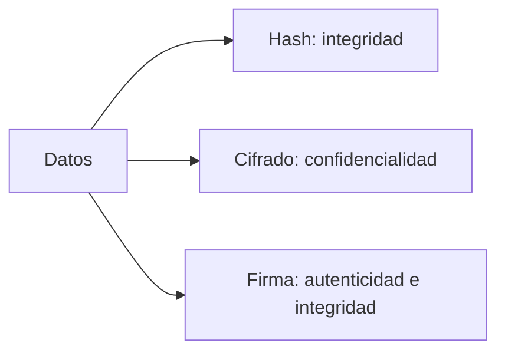
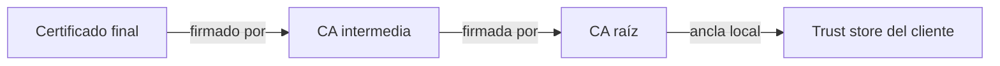

# Analizar un certificado HTTPS real e identificar emisor, vigencia, algoritmos y cadena de confianza

## Ruta guiada esencial — 25 minutos

### Escenario, objetivo y relación con la agenda

Recibes un certificado HTTPS y debes decidir si su identidad, vigencia y cadena son coherentes. El objetivo operativo es inspeccionar **un** certificado y registrar emisor, SAN, vigencia, algoritmo de firma, clave pública y cadena. Cubre la práctica aprobada del Capítulo 1 y los puntos 1.1 a 1.5.

### Prerrequisitos y archivos

- OpenSSL 1.1.1 o 3.x, navegador y acceso HTTPS autorizado.
- Conocimientos básicos de hash, cifrado asimétrico, CA, CSR y X.509.
- Se crearán `evidence/server-leaf.pem` y `evidence/certificate-analysis.md` bajo `<LAB_ROOT>`.
- Si no hay Internet, el instructor debe entregar un certificado público de muestra mediante `<CERTIFICATE_PATH>`.

#### Mapa visual: hash, cifrado y firma



#### Mapa visual: cadena de confianza



El servidor presenta normalmente el certificado final y las intermedias necesarias; la raíz permanece como ancla local del cliente.

### Procedimiento esencial

1. Prepara el entorno y selecciona un único hostname autorizado:

   ```bash
   export LAB_ROOT="${LAB_ROOT:-$HOME/cert-digital-lab}"
   export SERVICE_HOSTNAME="<SERVICE_HOSTNAME>"
   mkdir -p "$LAB_ROOT/evidence"
   cd "$LAB_ROOT/evidence"
   ```

2. Inspecciona el certificado en el navegador. Localiza Subject, Issuer, SAN, vigencia y cadena. El SAN, no solo el CN, debe contener el hostname usado.

3. Obtén el certificado final. La llave privada del servidor nunca se descarga:

   ```bash
   openssl s_client -connect "${SERVICE_HOSTNAME}:443" -servername "$SERVICE_HOSTNAME" </dev/null 2>/dev/null \
     | openssl x509 -out server-leaf.pem
   ```

4. Inspecciona los campos principales:

   ```bash
   openssl x509 -in server-leaf.pem -noout -subject -issuer -dates -serial -fingerprint -sha256
   openssl x509 -in server-leaf.pem -noout -ext subjectAltName
   openssl x509 -in server-leaf.pem -noout -text | grep -E "Signature Algorithm|Public Key Algorithm|Basic Constraints"
   ```

5. Registra la evidencia en `certificate-analysis.md`: hostname, Subject, Issuer, SAN, notBefore/notAfter, firma, clave pública, rol leaf/intermedia/raíz y una observación sobre revocación.

6. Valida vigencia y hostname de forma observable:

   ```bash
   openssl x509 -in server-leaf.pem -noout -checkend 0
   openssl x509 -in server-leaf.pem -noout -checkhost "$SERVICE_HOSTNAME"
   ```

### Resultado esperado y validación final

- `server-leaf.pem` comienza con `-----BEGIN CERTIFICATE-----` y no contiene una llave privada.
- `-checkend 0` y `-checkhost` terminan con código 0.
- El estudiante explica que una coincidencia textual Issuer/Subject no sustituye la validación criptográfica de cadena.
- Evidencia observable: `certificate-analysis.md` completo y salida exitosa de las dos validaciones.

### Seguridad, troubleshooting y limpieza

- No uses dominios del cliente ni omitas la validación TLS.
- Si la conexión está bloqueada, utiliza `<CERTIFICATE_PATH>` y copia solo el certificado público.
- Si `-checkhost` no existe en la versión instalada, revisa SAN con `-ext subjectAltName` y documenta la limitación.
- Conserva el análisis; elimina únicamente certificados temporales que no se usarán después. No ejecutes borrados recursivos sobre `<LAB_ROOT>`.

### Reflexión

1. ¿Por qué el SAN prevalece sobre el CN para validar el hostname?
2. ¿Qué firma el emisor y con qué clave se verifica?
3. ¿Por qué el servidor normalmente no necesita enviar la CA raíz?

### Actividades opcionales — fuera de los 25 minutos

Comparar otros certificados, separar la cadena presentada, consultar OCSP/CRL y ejecutar el procedimiento ampliado incluido al final de este documento. Estas actividades no son requisito para completar la práctica principal.

## 1. Metadatos

| Campo            | Detalle                                      |
|------------------|----------------------------------------------|
| **Duración**     | 45 minutos (ruta esencial)                   |
| **Complejidad**  | Fácil                                        |
| **Nivel Bloom**  | Aplicar (Apply)                              |
| **Modalidad**    | Individual / Guiada                          |
| **Entorno**      | Linux o WSL2 en Windows                      |

---

## 2. Descripción General

En esta práctica el estudiante inspeccionará certificados digitales X.509 de sitios HTTPS públicos utilizando el navegador web y la herramienta de línea de comandos `openssl s_client`. Se identificarán los campos principales del certificado (Subject, Issuer, Validity, Public Key, Extensions), se trazará la cadena de confianza desde el certificado de entidad final hasta la CA raíz, y se relacionarán los algoritmos criptográficos encontrados (RSA, ECDSA, SHA-256, etc.) con los conceptos de hash, cifrado asimétrico y firma digital vistos en la lección 1.1. Al finalizar, el estudiante completará una tabla comparativa de tres certificados reales que le servirá de referencia para las prácticas posteriores.

---

## 3. Objetivos de Aprendizaje

Al completar este laboratorio serás capaz de:

- [ ] Identificar y describir los campos principales de un certificado X.509 (Subject, Issuer, Validity, Public Key, Extensions) a partir de un certificado HTTPS real.
- [ ] Distinguir los roles de CA raíz, CA intermedia y certificado de entidad final dentro de una cadena de confianza.
- [ ] Utilizar `openssl s_client` y `openssl x509` para extraer información técnica de certificados de sitios públicos desde la línea de comandos.
- [ ] Relacionar los algoritmos criptográficos presentes en un certificado (RSA/ECDSA, SHA-256) con las propiedades de integridad, autenticidad y no repudio estudiadas en la lección 1.1.
- [ ] Interpretar el estado de revocación de un certificado mediante la URL de OCSP o CRL indicada en sus extensiones.

---

## 4. Prerrequisitos

### Conocimientos previos

| Tema                                           | Nivel requerido     |
|------------------------------------------------|---------------------|
| Conceptos de HTTP/HTTPS y qué es TLS           | Básico              |
| Criptografía asimétrica: clave pública/privada | Básico (Lección 1.1)|
| Funciones hash y firma digital                 | Básico (Lección 1.1)|
| Uso de terminal Linux / WSL2                   | Básico              |

### Acceso y herramientas

| Herramienta / Recurso                   | Versión mínima       | Verificación                          |
|-----------------------------------------|----------------------|---------------------------------------|
| OpenSSL                                 | 1.1.1 (recomendado 3.x) | `openssl version`                  |
| curl                                    | 7.x                  | `curl --version`                      |
| Mozilla Firefox o Google Chrome         | Firefox 115+ / Chrome 114+ | Abrir el navegador               |
| Conectividad a Internet (sitios HTTPS)  | Requerida            | `curl -I https://www.example.com`     |

> **Nota:** Si el entorno de laboratorio no tiene acceso a Internet, el instructor debe proveer los archivos `.pem` de referencia y los outputs de `openssl s_client` para los tres sitios.

---

## 5. Entorno de Laboratorio

### Configuración del directorio de trabajo

Ejecuta los siguientes comandos en tu terminal antes de iniciar:

```bash
# Crear directorio de trabajo persistente para todo el curso
export LAB_ROOT="$HOME/cert-digital-lab"
mkdir -p "$LAB_ROOT"/{certs,private,csr,exports,signed,scripts,config,evidence}
cd "$LAB_ROOT/evidence"

# Verificar versión de OpenSSL
openssl version -a

# Verificar conectividad a los tres sitios objetivo
curl -s -o /dev/null -w "%{http_code}" https://www.example.com
curl -s -o /dev/null -w "%{http_code}" https://www.example.org
curl -s -o /dev/null -w "%{http_code}" https://www.example.net
```

> **Sitios objetivo sugeridos** (puedes sustituirlos por sitios equivalentes accesibles desde tu entorno):
>
> | # | Sitio                      | Categoría           |
> |---|----------------------------|---------------------|
> | 1 | `www.example.com`          | Dominio reservado   |
> | 2 | `www.example.org`          | Dominio reservado   |
> | 3 | `www.example.net`          | Dominio reservado   |
>
> Si algún sitio no es accesible, utiliza los certificados PEM de referencia proporcionados por el instructor; no sustituyas el objetivo por dominios productivos.

### Variables de entorno de conveniencia

```bash
# Definir los tres sitios como variables para reutilizar en los comandos
export SITE1="www.example.com"
export SITE2="www.example.org"
export SITE3="www.example.net"
```

---

## Anexo opcional: procedimiento ampliado

> **Referencia no ejecutable sin revisión del instructor:** este anexo conserva variantes generadas originalmente para análisis. Puede depender de Internet, GNU `grep/awk/csplit` y salidas temporales. No uses `-noverify`, no desactives TLS y no ejecutes sus variantes fuera de un entorno aislado.

---

### Paso 1 — Inspección visual del certificado desde el navegador

**Objetivo:** Familiarizarse con la interfaz gráfica de inspección de certificados y localizar los campos principales antes de usar la línea de comandos.

#### Instrucciones

1. Abre Firefox o Chrome y navega a `https://www.example.com`.

2. Haz clic en el **candado** (🔒) en la barra de direcciones.
   - En Firefox: *Conexión segura* → *Más información* → pestaña **Seguridad** → botón **Ver certificado**.
   - En Chrome: *La conexión es segura* → **El certificado es válido**.

3. En el visor de certificados, localiza y anota los siguientes campos en la **Tabla de Trabajo 1** (al final de esta sección):

   | Campo a localizar         | ¿Dónde está en el visor?                            |
   |---------------------------|-----------------------------------------------------|
   | **Subject / CN**          | Pestaña "Detalles" → campo "Asunto"                 |
   | **Issuer / CN**           | Pestaña "Detalles" → campo "Emisor"                 |
   | **Valid From / Valid To** | Pestaña "General" o "Detalles" → "Período de validez"|
   | **Public Key Algorithm**  | Pestaña "Detalles" → "Información de clave pública" |
   | **Signature Algorithm**   | Pestaña "Detalles" → "Algoritmo de firma"           |
   | **SAN (Subject Alt Names)**| Pestaña "Detalles" → extensión "Nombres alternativos"|
   | **Key Usage / EKU**       | Pestaña "Detalles" → extensiones "Uso de clave"     |

4. Navega a la pestaña **Cadena de certificados** (Firefox) o haz clic en cada nivel de la jerarquía (Chrome). Identifica:
   - El **certificado de entidad final** (leaf): emitido para el dominio.
   - El **certificado intermedio**: emitido por la CA raíz para la CA intermedia.
   - El **certificado raíz**: autofirmado (Issuer = Subject).

5. Repite los pasos 1–4 para `https://www.example.org` y `https://www.example.net`.

#### Salida esperada

Al explorar la cadena de `www.example.com` deberías ver una estructura similar a esta (los nombres exactos de CA pueden cambiar):

```
Leaf:    CN=www.example.com
         Issuer: CN=<INTERMEDIATE_CA>
Interm:  CN=<INTERMEDIATE_CA>
         Issuer: CN=<TRUSTED_ROOT_CA>
Root:    CN=<TRUSTED_ROOT_CA>
         Issuer: CN=<TRUSTED_ROOT_CA>  ← autofirmado
```

> **Conexión con la lección 1.1:** La CA usa su **clave privada** para firmar el certificado del nivel inferior (firma sobre el hash del contenido X.509). Los clientes validan esa firma con la **clave pública** de la CA, que está anclada en el almacén de confianza del sistema operativo.

#### Verificación

- [ ] Puedes ver tres niveles distintos en la cadena (leaf → intermedio → raíz).
- [ ] El certificado raíz tiene Issuer = Subject (autofirmado).
- [ ] Los campos Subject y Issuer del certificado intermedio conectan los otros dos niveles.

---

### Paso 2 — Descarga del certificado con `openssl s_client`

**Objetivo:** Obtener el certificado del servidor en formato PEM desde la línea de comandos para poder inspeccionarlo con `openssl x509`.

#### Instrucciones

1. Descarga el **certificado de entidad final** (leaf) de cada sitio y guárdalo como archivo `.pem`:

```bash
cd "$LAB_ROOT/evidence"

# Sitio 1: Google (tecnología)
echo | openssl s_client -connect ${SITE1}:443 -servername ${SITE1} 2>/dev/null \
  | openssl x509 -out site1_leaf.pem
echo "✔ site1_leaf.pem guardado"

# Sitio 2: Gobierno
echo | openssl s_client -connect ${SITE2}:443 -servername ${SITE2} 2>/dev/null \
  | openssl x509 -out site2_leaf.pem
echo "✔ site2_leaf.pem guardado"

# Sitio 3: Banco
echo | openssl s_client -connect ${SITE3}:443 -servername ${SITE3} 2>/dev/null \
  | openssl x509 -out site3_leaf.pem
echo "✔ site3_leaf.pem guardado"
```

2. Descarga la **cadena completa** (leaf + intermedios) del Sitio 1 para el análisis de cadena de confianza del Paso 4:

```bash
echo | openssl s_client -connect ${SITE1}:443 -servername ${SITE1} \
  -showcerts 2>/dev/null > site1_fullchain.pem
echo "✔ site1_fullchain.pem guardado (cadena completa)"
```

3. Verifica que los archivos se crearon correctamente:

```bash
ls -lh "$LAB_ROOT/evidence/"
# Verifica que los .pem tienen tamaño > 0
wc -l site1_leaf.pem site2_leaf.pem site3_leaf.pem
```

#### Salida esperada

```
-rw-r--r-- 1 user user 2.1K site1_leaf.pem
-rw-r--r-- 1 user user 2.3K site2_leaf.pem
-rw-r--r-- 1 user user 1.9K site3_leaf.pem
-rw-r--r-- 1 user user 8.4K site1_fullchain.pem
```

> **Nota de seguridad:** Estos archivos contienen únicamente **claves públicas** (certificados). No hay información confidencial. Las claves privadas nunca se transmiten ni son accesibles mediante `s_client`.

#### Verificación

```bash
# Cada archivo debe comenzar con -----BEGIN CERTIFICATE-----
head -1 site1_leaf.pem site2_leaf.pem site3_leaf.pem
```

Salida esperada:
```
==> site1_leaf.pem <==
-----BEGIN CERTIFICATE-----
==> site2_leaf.pem <==
-----BEGIN CERTIFICATE-----
==> site3_leaf.pem <==
-----BEGIN CERTIFICATE-----
```

---

### Paso 3 — Inspección detallada de campos X.509 con `openssl x509`

**Objetivo:** Extraer y analizar cada campo relevante del certificado usando la línea de comandos, relacionando los algoritmos con los conceptos de la lección 1.1.

#### Instrucciones

1. Inspecciona el certificado completo del Sitio 1 en formato legible:

```bash
openssl x509 -in site1_leaf.pem -text -noout
```

2. Extrae campos específicos de forma programática para los tres sitios. Ejecuta el siguiente bloque que genera un reporte estructurado:

```bash
for SITE_FILE in site1_leaf.pem site2_leaf.pem site3_leaf.pem; do
  echo "=========================================="
  echo "CERTIFICADO: $SITE_FILE"
  echo "=========================================="

  echo "--- Subject (CN) ---"
  openssl x509 -in $SITE_FILE -noout -subject

  echo "--- Issuer ---"
  openssl x509 -in $SITE_FILE -noout -issuer

  echo "--- Vigencia ---"
  openssl x509 -in $SITE_FILE -noout -dates

  echo "--- Algoritmo de firma ---"
  openssl x509 -in $SITE_FILE -noout -text | grep "Signature Algorithm" | head -2

  echo "--- Clave pública ---"
  openssl x509 -in $SITE_FILE -noout -text | grep -A2 "Public Key Algorithm"

  echo "--- Serial Number ---"
  openssl x509 -in $SITE_FILE -noout -serial

  echo "--- Fingerprint SHA-256 ---"
  openssl x509 -in $SITE_FILE -noout -fingerprint -sha256

  echo "--- SANs (Subject Alternative Names) ---"
  openssl x509 -in $SITE_FILE -noout -ext subjectAltName 2>/dev/null || \
    openssl x509 -in $SITE_FILE -noout -text | grep -A3 "Subject Alternative Name"

  echo "--- Key Usage ---"
  openssl x509 -in $SITE_FILE -noout -ext keyUsage 2>/dev/null || \
    openssl x509 -in $SITE_FILE -noout -text | grep -A2 "Key Usage"

  echo "--- Extended Key Usage ---"
  openssl x509 -in $SITE_FILE -noout -ext extendedKeyUsage 2>/dev/null || \
    openssl x509 -in $SITE_FILE -noout -text | grep -A2 "Extended Key Usage"

  echo "--- Basic Constraints ---"
  openssl x509 -in $SITE_FILE -noout -ext basicConstraints 2>/dev/null || \
    openssl x509 -in $SITE_FILE -noout -text | grep -A2 "Basic Constraints"

  echo "--- OCSP / CRL URLs ---"
  openssl x509 -in $SITE_FILE -noout -text | grep -E "(OCSP|CRL)" | head -5

  echo ""
done
```

3. Guarda el reporte en un archivo para referencia:

```bash
for SITE_FILE in site1_leaf.pem site2_leaf.pem site3_leaf.pem; do
  echo "=== $SITE_FILE ===" >> reporte_certs.txt
  openssl x509 -in $SITE_FILE -noout -subject -issuer -dates -serial -fingerprint -sha256 >> reporte_certs.txt
  echo "" >> reporte_certs.txt
done
cat reporte_certs.txt
```

#### Salida esperada (ejemplo ilustrativo para `site1_leaf.pem`)

```
==========================================
CERTIFICADO: site1_leaf.pem
==========================================
--- Subject (CN) ---
subject=CN=www.example.com

--- Issuer ---
issuer=C=<COUNTRY>, O=<CA_ORGANIZATION>, CN=<INTERMEDIATE_CA>

--- Vigencia ---
notBefore=Nov  6 08:22:45 2024 GMT
notAfter=Jan 29 08:22:44 2025 GMT

--- Algoritmo de firma ---
        Signature Algorithm: ecdsa-with-SHA256
        Signature Algorithm: ecdsa-with-SHA256

--- Clave pública ---
        Public Key Algorithm: id-ecPublicKey
            Public-Key: (256 bit)

--- Serial Number ---
serial=1A2B3C4D5E6F...

--- Fingerprint SHA-256 ---
SHA256 Fingerprint=AA:BB:CC:...

--- SANs ---
X509v3 Subject Alternative Name:
    DNS:www.example.com

--- Key Usage ---
X509v3 Key Usage: critical
    Digital Signature

--- Extended Key Usage ---
X509v3 Extended Key Usage:
    TLS Web Server Authentication, TLS Web Client Authentication

--- Basic Constraints ---
X509v3 Basic Constraints: critical
    CA:FALSE

--- OCSP / CRL URLs ---
                OCSP - URI:http://ocsp.pki.goog/gts1c3
                Full Name:
                  URI:http://crls.pki.goog/gts1c3/...
```

> **Análisis — Conexión con Lección 1.1:**
>
> - `Signature Algorithm: ecdsa-with-SHA256` → La CA calculó el **hash SHA-256** del contenido del certificado y lo firmó con su **clave privada ECDSA**. Esto garantiza **integridad** y **autenticidad** del certificado.
> - `Public Key Algorithm: id-ecPublicKey (256 bit)` → El servidor posee un par de claves de **curva elíptica**. La clave pública aquí contenida se usará para el intercambio ECDH durante el handshake TLS.
> - `Basic Constraints: CA:FALSE` → Este es un certificado de **entidad final** (leaf), no puede firmar otros certificados.
> - `Key Usage: Digital Signature` → La clave privada del servidor se usa para firmar mensajes en el handshake TLS (autenticación).

#### Verificación

```bash
# Verificar que cada certificado es un leaf (no CA)
for f in site1_leaf.pem site2_leaf.pem site3_leaf.pem; do
  echo -n "$f → Basic Constraints: "
  openssl x509 -in $f -noout -text | grep -A1 "Basic Constraints" | tail -1
done
```

Salida esperada: los tres deben mostrar `CA:FALSE`.

---

### Paso 4 — Análisis de la cadena de confianza completa

**Objetivo:** Trazar la cadena de confianza completa del Sitio 1 (leaf → intermedio → raíz) y verificar cada eslabón criptográficamente.

#### Instrucciones

1. Extrae cada certificado de la cadena completa del Sitio 1. El archivo `site1_fullchain.pem` contiene múltiples certificados en orden (leaf primero):

```bash
# Contar cuántos certificados hay en la cadena
grep -c "BEGIN CERTIFICATE" site1_fullchain.pem
```

2. Separa cada certificado de la cadena en archivos individuales:

```bash
# Extraer el certificado leaf (primero en la cadena)
awk '/BEGIN CERT/{c++} c==1' site1_fullchain.pem | \
  awk '/END CERT/{print; exit} 1' > chain_leaf.pem

# Extraer el certificado intermedio (segundo en la cadena)
awk '/BEGIN CERT/{c++} c==2' site1_fullchain.pem | \
  awk '/END CERT/{print; exit} 1' > chain_intermediate.pem

# Si existe un tercer certificado (segunda CA intermedia o raíz)
awk '/BEGIN CERT/{c++} c==3' site1_fullchain.pem | \
  awk '/END CERT/{print; exit} 1' > chain_root_or_second_intermediate.pem 2>/dev/null || true
```

> **Alternativa más robusta con `csplit`:**
> ```bash
> csplit -z -f chain_cert_ --suffix-format='%02d.pem' site1_fullchain.pem \
>   '/-----BEGIN CERTIFICATE-----/' '{*}' 2>/dev/null || true
> ls chain_cert_*.pem
> ```

3. Inspecciona la relación entre el leaf y el intermedio:

```bash
echo "=== LEAF ==="
echo "  Subject: $(openssl x509 -in chain_leaf.pem -noout -subject)"
echo "  Issuer:  $(openssl x509 -in chain_leaf.pem -noout -issuer)"

echo ""
echo "=== INTERMEDIO ==="
echo "  Subject: $(openssl x509 -in chain_intermediate.pem -noout -subject)"
echo "  Issuer:  $(openssl x509 -in chain_intermediate.pem -noout -issuer)"
echo "  Basic Constraints: $(openssl x509 -in chain_intermediate.pem -noout -text | grep -A1 'Basic Constraints' | tail -1)"
```

4. Verifica que el **Issuer del leaf** coincide con el **Subject del intermedio** (esto es lo que forma la cadena):

```bash
LEAF_ISSUER=$(openssl x509 -in chain_leaf.pem -noout -issuer)
INTERM_SUBJECT=$(openssl x509 -in chain_intermediate.pem -noout -subject)

echo "Issuer del leaf:       $LEAF_ISSUER"
echo "Subject del intermedio: $INTERM_SUBJECT"

# Comparación simplificada del CN
LEAF_ISSUER_CN=$(openssl x509 -in chain_leaf.pem -noout -issuer | grep -oP 'CN\s*=\s*\K[^,/]+')
INTERM_SUBJECT_CN=$(openssl x509 -in chain_intermediate.pem -noout -subject | grep -oP 'CN\s*=\s*\K[^,/]+')

if [ "$LEAF_ISSUER_CN" = "$INTERM_SUBJECT_CN" ]; then
  echo "✔ CADENA VÁLIDA: el Issuer del leaf coincide con el Subject del intermedio"
else
  echo "✗ ADVERTENCIA: no coinciden (puede haber más de un intermedio)"
fi
```

5. Verifica que el certificado intermedio tiene `CA:TRUE` en Basic Constraints (puede firmar otros certificados):

```bash
openssl x509 -in chain_intermediate.pem -noout -text | grep -A2 "Basic Constraints"
```

#### Salida esperada

```
=== LEAF ===
  Subject: subject=CN=www.example.com
  Issuer:  issuer=C=<COUNTRY>, O=<CA_ORGANIZATION>, CN=<INTERMEDIATE_CA>

=== INTERMEDIO ===
  Subject: subject=C=<COUNTRY>, O=<CA_ORGANIZATION>, CN=<INTERMEDIATE_CA>
  Issuer:  issuer=C=<COUNTRY>, O=<CA_ORGANIZATION>, CN=<TRUSTED_ROOT_CA>
  Basic Constraints:
                CA:TRUE, pathlen:0

✔ CADENA VÁLIDA: el Issuer del leaf coincide con el Subject del intermedio
```

> **Análisis — Conexión con Lección 1.1:**
>
> - `CA:TRUE` en el intermedio confirma que este certificado tiene la capacidad de **firmar otros certificados** usando su clave privada. La CA raíz firmó el certificado intermedio (firma sobre el hash SHA-256 de su contenido); la CA intermedia firmó el certificado leaf. Esta es la **cadena de firmas digitales** que construye la confianza.
> - `pathlen:0` en el intermedio significa que no puede haber otra CA intermedia por debajo de él; solo puede firmar certificados de entidad final.

#### Verificación

- [ ] El Issuer del leaf coincide con el Subject del intermedio.
- [ ] El intermedio tiene `Basic Constraints: CA:TRUE`.
- [ ] El leaf tiene `Basic Constraints: CA:FALSE`.

---

### Paso 5 — Verificación de OCSP y análisis de revocación

**Objetivo:** Identificar los mecanismos de revocación (OCSP y CRL) presentes en los certificados y consultar el estado de un certificado en tiempo real.

#### Instrucciones

1. Extrae la URL del respondedor OCSP del certificado del Sitio 1:

```bash
OCSP_URL=$(openssl x509 -in site1_leaf.pem -noout -text | \
  grep -oP 'OCSP - URI:\K\S+' | head -1)
echo "URL OCSP: $OCSP_URL"
```

2. Extrae la URL de la CRL:

```bash
CRL_URL=$(openssl x509 -in site1_leaf.pem -noout -text | \
  grep -oP 'URI:\K(http://[^\s]+\.crl)' | head -1)
echo "URL CRL: $CRL_URL"
```

3. Consulta el estado OCSP del certificado leaf usando el intermedio como emisor:

```bash
# Solo si tienes la URL OCSP y el certificado intermedio
if [ -n "$OCSP_URL" ] && [ -f "chain_intermediate.pem" ]; then
  echo "Consultando OCSP: $OCSP_URL"
  openssl ocsp \
    -issuer chain_intermediate.pem \
    -cert site1_leaf.pem \
    -url "$OCSP_URL" \
    -text \
    -noverify 2>&1 | grep -E "(Response Status|Cert Status|This Update|Next Update|ERROR)" | head -10
else
  echo "OCSP URL no disponible o certificado intermedio no encontrado"
fi
```

4. Descarga y examina la CRL (si está disponible):

```bash
if [ -n "$CRL_URL" ]; then
  echo "Descargando CRL: $CRL_URL"
  curl -s "$CRL_URL" -o site1.crl
  openssl crl -in site1.crl -inform DER -text -noout 2>/dev/null | \
    grep -E "(Issuer|Last Update|Next Update|Revoked)" | head -10
else
  echo "CRL URL no disponible en este certificado"
fi
```

#### Salida esperada

```
URL OCSP: http://ocsp.pki.goog/gts1c3

Consultando OCSP: http://ocsp.pki.goog/gts1c3
Response Status: successful (0x0)
Cert Status: good
This Update: Nov 10 12:00:00 2024 GMT
Next Update: Nov 17 12:00:00 2024 GMT
```

> **Análisis:** `Cert Status: good` confirma que el certificado **no ha sido revocado**. El respondedor OCSP firma su respuesta con la clave privada de la CA (o un delegado OCSP), lo que nuevamente aplica el concepto de **firma digital con clave asimétrica** de la lección 1.1.

#### Verificación

```bash
# Verificar que el certificado está vigente (no expirado)
openssl x509 -in site1_leaf.pem -noout -checkend 0 && \
  echo "✔ Certificado vigente" || echo "✗ Certificado EXPIRADO"
```

---

### Paso 6 — Completar la tabla comparativa de los tres certificados

**Objetivo:** Consolidar los hallazgos de los pasos anteriores en una tabla comparativa que evidencie similitudes y diferencias entre los tres certificados analizados.

#### Instrucciones

1. Genera automáticamente los datos para la tabla comparativa:

```bash
echo "Generando tabla comparativa..."
echo ""
printf "%-30s %-35s %-35s %-35s\n" "CAMPO" "SITIO 1 (Tecnología)" "SITIO 2 (Gobierno)" "SITIO 3 (Banco)"
printf "%-30s %-35s %-35s %-35s\n" "------------------------------" "-----------------------------------" "-----------------------------------" "-----------------------------------"

for FIELD in "subject" "issuer" "dates"; do
  printf "%-30s" "$FIELD"
  for SITE_FILE in site1_leaf.pem site2_leaf.pem site3_leaf.pem; do
    VALUE=$(openssl x509 -in $SITE_FILE -noout -$FIELD 2>/dev/null | head -1 | cut -c1-33)
    printf " %-35s" "$VALUE"
  done
  echo ""
done
```

2. Completa manualmente la **Tabla de Trabajo 1** con los datos obtenidos en los pasos anteriores:

---

#### Tabla de Trabajo 1 — Comparativa de Certificados HTTPS

| Campo                        | Sitio 1 (Tecnología) | Sitio 2 (Gobierno) | Sitio 3 (Banco) |
|------------------------------|----------------------|--------------------|-----------------|
| **Dominio / CN**             | _____________        | _____________      | _____________   |
| **Organización (O)**         | _____________        | _____________      | _____________   |
| **Emisor (CA Intermedia)**   | _____________        | _____________      | _____________   |
| **CA Raíz**                  | _____________        | _____________      | _____________   |
| **Válido desde**             | _____________        | _____________      | _____________   |
| **Válido hasta**             | _____________        | _____________      | _____________   |
| **Días de vigencia restantes**| _____________       | _____________      | _____________   |
| **Algoritmo de firma**       | _____________        | _____________      | _____________   |
| **Algoritmo de clave pública**| _____________       | _____________      | _____________   |
| **Tamaño de clave**          | _____________        | _____________      | _____________   |
| **SANs (cantidad)**          | _____________        | _____________      | _____________   |
| **Key Usage**                | _____________        | _____________      | _____________   |
| **Extended Key Usage**       | _____________        | _____________      | _____________   |
| **Basic Constraints (CA?)**  | _____________        | _____________      | _____________   |
| **URL OCSP**                 | _____________        | _____________      | _____________   |
| **URL CRL**                  | _____________        | _____________      | _____________   |
| **Niveles en la cadena**     | _____________        | _____________      | _____________   |

---

3. Responde las siguientes preguntas de análisis en tu cuaderno o archivo de notas:

   **Pregunta 1:** ¿Qué algoritmo de firma es más común entre los tres certificados? ¿Por qué ECDSA con SHA-256 es preferido sobre RSA con SHA-256 en la actualidad? *(Pista: recuerda las ventajas de las curvas elípticas mencionadas en la lección 1.1.)*

   **Pregunta 2:** ¿Cuál es el propósito de la extensión `Basic Constraints: CA:FALSE` en el certificado leaf? ¿Qué problema de seguridad previene?

   **Pregunta 3:** En la cadena de confianza, ¿cómo se relaciona el concepto de **firma digital** (lección 1.1) con la validación de cada eslabón? Describe el proceso de verificación de un eslabón.

   **Pregunta 4:** ¿Qué diferencias observas entre el certificado del sitio gubernamental y el del banco en términos de emisor y estructura de cadena? ¿Ambos usan CAs comerciales o hay CAs gubernamentales?

   **Pregunta 5:** ¿Qué pasaría con la seguridad de la conexión si el algoritmo de hash usado en la firma del certificado fuera SHA-1 en lugar de SHA-256? *(Pista: resistencia a colisiones.)*

#### Verificación

```bash
# Script de verificación final: comprobar que los 3 certificados están vigentes
echo "=== Verificación de vigencia ==="
for SITE_FILE in site1_leaf.pem site2_leaf.pem site3_leaf.pem; do
  echo -n "$SITE_FILE: "
  openssl x509 -in $SITE_FILE -noout -checkend 0 && echo "✔ VIGENTE" || echo "✗ EXPIRADO"
done

echo ""
echo "=== Días restantes de vigencia ==="
for SITE_FILE in site1_leaf.pem site2_leaf.pem site3_leaf.pem; do
  EXPIRY=$(openssl x509 -in $SITE_FILE -noout -enddate | cut -d= -f2)
  EXPIRY_EPOCH=$(date -d "$EXPIRY" +%s 2>/dev/null || date -j -f "%b %d %T %Y %Z" "$EXPIRY" +%s)
  NOW_EPOCH=$(date +%s)
  DAYS_LEFT=$(( (EXPIRY_EPOCH - NOW_EPOCH) / 86400 ))
  echo "  $SITE_FILE: $DAYS_LEFT días restantes (expira: $EXPIRY)"
done
```

---

## 7. Validación y Pruebas

Ejecuta el siguiente script de validación para confirmar que completaste todos los pasos del laboratorio correctamente:

```bash
#!/bin/bash
echo "============================================"
echo "  VALIDACIÓN LAB 01-00-01"
echo "============================================"
PASS=0
FAIL=0
LAB_ROOT="${LAB_ROOT:-$HOME/cert-digital-lab}"
cd "$LAB_ROOT/evidence" 2>/dev/null || { echo "✗ Directorio de trabajo no encontrado"; exit 1; }

# Test 1: Archivos PEM de los tres sitios existen
for f in site1_leaf.pem site2_leaf.pem site3_leaf.pem; do
  if [ -s "$f" ]; then
    echo "✔ PASS: $f existe y tiene contenido"
    ((PASS++))
  else
    echo "✗ FAIL: $f no existe o está vacío"
    ((FAIL++))
  fi
done

# Test 2: Todos los archivos son certificados X.509 válidos
for f in site1_leaf.pem site2_leaf.pem site3_leaf.pem; do
  if openssl x509 -in "$f" -noout 2>/dev/null; then
    echo "✔ PASS: $f es un certificado X.509 válido"
    ((PASS++))
  else
    echo "✗ FAIL: $f no es un certificado X.509 válido"
    ((FAIL++))
  fi
done

# Test 3: Todos los certificados son leaf (CA:FALSE)
for f in site1_leaf.pem site2_leaf.pem site3_leaf.pem; do
  BC=$(openssl x509 -in "$f" -noout -text 2>/dev/null | grep -A1 "Basic Constraints" | grep -c "CA:FALSE")
  if [ "$BC" -ge 1 ]; then
    echo "✔ PASS: $f tiene Basic Constraints CA:FALSE (es leaf)"
    ((PASS++))
  else
    echo "✗ FAIL: $f no tiene CA:FALSE o Basic Constraints no encontrado"
    ((FAIL++))
  fi
done

# Test 4: Cadena completa del sitio 1 descargada
if [ -s "site1_fullchain.pem" ]; then
  CERT_COUNT=$(grep -c "BEGIN CERTIFICATE" site1_fullchain.pem)
  echo "✔ PASS: site1_fullchain.pem existe con $CERT_COUNT certificados en la cadena"
  ((PASS++))
else
  echo "✗ FAIL: site1_fullchain.pem no existe o está vacío"
  ((FAIL++))
fi

# Test 5: Certificado intermedio extraído
if [ -s "chain_intermediate.pem" ]; then
  CA_TRUE=$(openssl x509 -in chain_intermediate.pem -noout -text 2>/dev/null | grep -c "CA:TRUE")
  if [ "$CA_TRUE" -ge 1 ]; then
    echo "✔ PASS: chain_intermediate.pem existe y tiene CA:TRUE"
    ((PASS++))
  else
    echo "⚠ WARN: chain_intermediate.pem existe pero no tiene CA:TRUE explícito"
    ((PASS++))
  fi
else
  echo "✗ FAIL: chain_intermediate.pem no encontrado (ejecutar Paso 4)"
  ((FAIL++))
fi

# Test 6: Reporte generado
if [ -s "reporte_certs.txt" ]; then
  echo "✔ PASS: reporte_certs.txt generado"
  ((PASS++))
else
  echo "✗ FAIL: reporte_certs.txt no encontrado"
  ((FAIL++))
fi

echo ""
echo "============================================"
echo "  RESULTADO: $PASS pruebas pasadas, $FAIL fallidas"
if [ "$FAIL" -eq 0 ]; then
  echo "  🎉 LABORATORIO COMPLETADO EXITOSAMENTE"
else
  echo "  ⚠ Revisar los pasos con FAIL antes de continuar"
fi
echo "============================================"
```

Guarda este script y ejecútalo:

```bash
chmod +x "$LAB_ROOT/evidence/validar_lab.sh" 2>/dev/null || true
bash "$LAB_ROOT/evidence/validar_lab.sh"
```

**Criterio de aprobación:** Mínimo 10 de 12 pruebas en PASS.

---

## 8. Solución de Problemas

### Problema 1 — `openssl s_client` no recibe respuesta o devuelve un certificado vacío

**Síntoma:**
```bash
echo | openssl s_client -connect www.example.net:443 -servername www.example.net 2>/dev/null \
  | openssl x509 -out site3_leaf.pem
# El archivo site3_leaf.pem queda vacío (0 bytes) o aparece el error:
# "unable to load certificate"
```

**Causa probable:**
El sitio puede estar bloqueado por el firewall del laboratorio, tener una configuración TLS especial (SNI estricto, TLS 1.3 solamente, o requerir un User-Agent específico), o puede estar temporalmente inaccesible. También puede ocurrir si `openssl s_client` no recibe el certificado antes de que el pipe se cierre.

**Solución:**

```bash
# Opción 1: Agregar timeout explícito y verificar la conexión primero
timeout 10 openssl s_client -connect www.example.net:443 \
  -servername www.example.net \
  -tls1_2 \
  </dev/null 2>&1 | head -30

# Opción 2: Usar un sitio alternativo conocido y accesible
export SITE3="www.example.org"
echo | openssl s_client -connect ${SITE3}:443 -servername ${SITE3} 2>/dev/null \
  | openssl x509 -out site3_leaf.pem

# Opción 3: Usar curl para verificar conectividad primero
curl -v --max-time 10 https://www.example.net 2>&1 | grep -E "(SSL|TLS|certificate|Connected)"

# Opción 4: Si el laboratorio no tiene acceso a Internet, usar un certificado de prueba
# El instructor debe proveer archivos .pem de referencia como alternativa
```

---

### Problema 2 — La cadena de confianza solo muestra un certificado (sin intermedios)

**Síntoma:**
```bash
grep -c "BEGIN CERTIFICATE" site1_fullchain.pem
# Resultado: 1  (solo el leaf, sin intermedios)
```

O al intentar extraer el intermedio:
```bash
openssl x509 -in chain_intermediate.pem -noout -subject
# Error: unable to load certificate
# 34359738368:error:0900006e:...
```

**Causa probable:**
Algunos servidores están mal configurados y no envían la cadena completa de certificados durante el handshake TLS, solo el certificado leaf. Esto es un error de configuración del servidor (aunque el navegador puede resolver los intermedios usando AIA - Authority Information Access). El flag `-showcerts` de `openssl s_client` solo muestra lo que el servidor envía.

**Solución:**

```bash
# Opción 1: Descargar el intermedio manualmente usando la URL AIA del certificado
AIA_URL=$(openssl x509 -in site1_leaf.pem -noout -text | \
  grep -oP 'CA Issuers - URI:\K\S+' | head -1)
echo "URL AIA: $AIA_URL"

if [ -n "$AIA_URL" ]; then
  curl -s "$AIA_URL" -o intermediate.der
  # Convertir de DER a PEM si es necesario
  openssl x509 -in intermediate.der -inform DER -out chain_intermediate.pem
  echo "✔ Intermedio descargado desde AIA"
  openssl x509 -in chain_intermediate.pem -noout -subject -issuer
fi

# Opción 2: Cambiar a un sitio que sí envíe la cadena completa
# Google, GitHub y Cloudflare típicamente envían cadena completa
export SITE1="github.com"
echo | openssl s_client -connect ${SITE1}:443 -servername ${SITE1} \
  -showcerts 2>/dev/null > site1_fullchain.pem
grep -c "BEGIN CERTIFICATE" site1_fullchain.pem
```

---

## 9. Limpieza del Entorno

Al finalizar el laboratorio, los archivos generados son **certificados públicos** (no contienen información confidencial). Sin embargo, mantén el directorio organizado para las prácticas siguientes:

```bash
cd "$LAB_ROOT/evidence"

# Verificar qué archivos se generaron
ls -lh

# Los archivos .pem de certificados y el reporte son NECESARIOS para prácticas futuras
# NO eliminar: site1_leaf.pem, site2_leaf.pem, site3_leaf.pem
# NO eliminar: chain_intermediate.pem, site1_fullchain.pem
# NO eliminar: reporte_certs.txt

# Puedes limpiar archivos temporales intermedios si lo deseas
rm -f site1.crl intermediate.der chain_cert_*.pem 2>/dev/null

echo "Archivos conservados para prácticas futuras:"
ls -lh "$LAB_ROOT/evidence/"
```

> **Recordatorio para prácticas posteriores:** Los archivos `site1_leaf.pem` y `chain_intermediate.pem` son evidencia opcional. La Práctica 5 utiliza artefactos reproducibles propios y no depende de estos archivos.

---

## 10. Resumen

### Conceptos cubiertos en este laboratorio

| Concepto                          | Herramienta utilizada              | Conexión con Lección 1.1                                    |
|-----------------------------------|------------------------------------|-------------------------------------------------------------|
| Campos X.509 (Subject, Issuer, Validity) | `openssl x509 -text`        | Estructura que contiene la clave pública del servidor       |
| Algoritmo de firma (ecdsa-with-SHA256) | `openssl x509 -text`          | Hash SHA-256 del certificado firmado con clave privada ECDSA|
| Cadena de confianza (leaf → CA)   | `openssl s_client -showcerts`      | Cadena de firmas digitales que construye la confianza        |
| Basic Constraints (CA:TRUE/FALSE) | `openssl x509 -ext basicConstraints` | Controla quién puede firmar certificados                   |
| Key Usage / Extended Key Usage    | `openssl x509 -ext keyUsage`       | Define el uso permitido de la clave pública/privada         |
| OCSP / CRL                        | `openssl ocsp`, `curl`             | Firma digital en respuestas OCSP (autenticidad de estado)   |
| Fingerprint SHA-256               | `openssl x509 -fingerprint -sha256`| Hash del certificado como identificador único               |

### Puntos clave aprendidos

1. **Un certificado X.509 es un contenedor de clave pública firmado** por una CA usando su clave privada sobre el hash SHA-256 del contenido del certificado — esto conecta directamente con los conceptos de firma digital y hash de la lección 1.1.

2. **La cadena de confianza es una cadena de firmas digitales**: cada eslabón está firmado por el nivel superior, y la confianza se ancla en el certificado raíz almacenado en el sistema operativo o navegador.

3. **Los algoritmos importan**: ECDSA con SHA-256 es hoy el estándar dominante por su eficiencia y seguridad equivalente a RSA con claves mucho más cortas. SHA-1 está deprecado por su vulnerabilidad a colisiones.

4. **OCSP y CRL son mecanismos de revocación** que permiten verificar si un certificado fue revocado antes de su fecha de expiración. Las respuestas OCSP también están firmadas digitalmente.

5. **`Basic Constraints: CA:FALSE`** en el certificado leaf previene que un atacante use ese certificado para firmar certificados fraudulentos, incluso si compromete la clave privada del servidor.

### Recursos adicionales

- [RFC 5280: Internet X.509 Public Key Infrastructure Certificate and CRL Profile](https://www.rfc-editor.org/rfc/rfc5280)
- [RFC 6960: X.509 Internet Public Key Infrastructure Online Certificate Status Protocol - OCSP](https://www.rfc-editor.org/rfc/rfc6960)
- [Documentación OpenSSL: openssl-x509](https://www.openssl.org/docs/man3.0/man1/openssl-x509.html)
- [Documentación OpenSSL: openssl-s_client](https://www.openssl.org/docs/man3.0/man1/openssl-s_client.html)
- [SSL Labs Server Test](https://www.ssllabs.com/ssltest/) — Herramienta web para análisis profundo de configuraciones TLS
- [crt.sh](https://crt.sh/) — Base de datos pública de Certificate Transparency para buscar certificados emitidos

---

> **Próxima práctica:** En la **Práctica 2** utilizarás OpenSSL para generar una llave, una CSR y un certificado autofirmado de entidad final. La CA raíz e intermedia se crearán únicamente en el escenario controlado del Capítulo 5.
