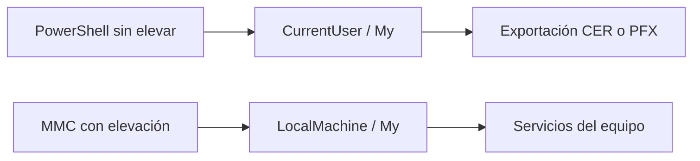

# Crear, instalar y exportar un certificado desde Windows para uso local.

## Ruta guiada esencial — 20 minutos

### Escenario, objetivo y relación con la agenda

Necesitas crear y respaldar de forma controlada un certificado local de Windows. Distinguirás `CurrentUser` de `LocalMachine`, crearás un certificado en el ámbito del usuario y exportarás su parte pública y un PFX protegido. Cubre 3.1 a 3.4 y la práctica aprobada del Capítulo 3.

### Prerrequisitos y archivos

- Windows 10/11, PowerShell 5.1 o 7 y módulo PKI.
- `certmgr.msc`; MMC y `LocalMachine` requieren privilegios administrativos y se dejan como demostración del instructor.
- Archivos: `exports/server.cer`, `exports/certificate.pfx` y `evidence/thumbprint.txt`.



`My` almacena certificados personales. `Root` y `CA` no son destinos para el certificado leaf de esta práctica.

### Procedimiento esencial

1. Prepara el entorno sin elevar privilegios:

   ```powershell
   $LabRoot = Join-Path $HOME "cert-digital-lab"
   @("certs","private","csr","exports","signed","scripts","config","evidence") |
     ForEach-Object { New-Item -ItemType Directory -Path (Join-Path $LabRoot $_) -Force | Out-Null }
   Get-Module -ListAvailable PKI
   ```

2. Abre `certmgr.msc` y localiza `Personal`, `Trusted Root Certification Authorities` e `Intermediate Certification Authorities`. No importes todavía nada en Root o CA.

3. Crea el certificado leaf en `CurrentUser\My`:

   ```powershell
   $cert = New-SelfSignedCertificate `
     -Subject "CN=service.local, O=CERT_DIG Lab" `
     -DnsName "service.local","api.service.local" `
     -CertStoreLocation "Cert:\CurrentUser\My" `
     -KeyAlgorithm RSA -KeyLength 2048 -HashAlgorithm SHA256 `
     -KeyUsage DigitalSignature,KeyEncipherment `
     -TextExtension @("2.5.29.37={text}1.3.6.1.5.5.7.3.1") `
     -NotAfter (Get-Date).AddDays(365)
   $cert.Thumbprint | Set-Content (Join-Path $LabRoot "evidence\thumbprint.txt")
   ```

4. Verifica Subject, vigencia, SAN, EKU y llave asociada:

   ```powershell
   $cert | Format-List Subject,Thumbprint,NotBefore,NotAfter,HasPrivateKey
   $cert.Extensions | Format-Table Oid,Format
   ```

5. Exporta el certificado público:

   ```powershell
   Export-Certificate -Cert $cert -FilePath (Join-Path $LabRoot "exports\server.cer") -Type CERT
   ```

6. Exporta el PFX solicitando `<PFX_PASSWORD>` sin mostrarla:

   ```powershell
   $PfxPassword = Read-Host "<PFX_PASSWORD>" -AsSecureString
   Export-PfxCertificate -Cert $cert -FilePath (Join-Path $LabRoot "exports\certificate.pfx") -Password $PfxPassword
   $PfxPassword = $null
   ```

### Resultado esperado y validación final

- `CurrentUser\My` contiene el certificado y `HasPrivateKey` es `True`.
- `server.cer` no contiene llave privada; `certificate.pfx` sí la transporta protegida.
- Verificación observable:

  ```powershell
  $public = [System.Security.Cryptography.X509Certificates.X509Certificate2]::new((Join-Path $LabRoot "exports\server.cer"))
  $public.HasPrivateKey -eq $false
  Test-Path (Join-Path $LabRoot "exports\certificate.pfx")
  ```

### Seguridad, troubleshooting y limpieza

- No instales un leaf en `Root` o `CA`; esos stores corresponden a anclas e intermedias reales.
- Restringe la ACL de `exports` al usuario actual y evita carpetas sincronizadas o compartidas para el PFX:

  ```powershell
  $ExportsPath = Join-Path $LabRoot "exports"
  icacls $ExportsPath /inheritance:r /grant:r "$($env:USERNAME):(OI)(CI)(F)"
  ```

- Si `Export-PfxCertificate` falla, confirma `HasPrivateKey` y que la llave sea exportable en este laboratorio.
- `LocalMachine` requiere elevación; no cambies políticas de ejecución si solo ejecutas comandos interactivos.
- Al terminar el curso, elimina el certificado por thumbprint exacto y borra el PFX con `Remove-Item -LiteralPath (Join-Path $LabRoot "exports\certificate.pfx")`; conserva el CER si se requiere como evidencia.

### Reflexión

1. ¿Qué identidad usa `CurrentUser` y qué servicios necesitan `LocalMachine`?
2. ¿Por qué un CER puede compartirse y un PFX debe protegerse?
3. ¿Qué riesgo introduce marcar una llave como exportable?

### Actividades opcionales — fuera de los 20 minutos

Explorar MMC con ambos ámbitos, importar el PFX en un equipo aislado y convertir CER entre DER y PEM. El procedimiento ampliado queda como referencia opcional.

## Metadatos

| Campo            | Detalle                                      |
|------------------|----------------------------------------------|
| **Duración**     | 45 minutos (ruta esencial)                   |
| **Complejidad**  | Media                                        |
| **Nivel Bloom**  | Crear (Create)                               |
| **Plataforma**   | Windows 10/11 o Windows Server 2019/2022     |
| **Práctica N.°** | 3 de 5                                       |

---

## Descripción General

En esta práctica explorarás el almacén de certificados de Windows en sus dos ámbitos principales —usuario actual (`CurrentUser`) y equipo local (`LocalMachine`)— utilizando `certmgr.msc`, `certlm.msc` y la consola MMC. Generarás un certificado autofirmado mediante el cmdlet `New-SelfSignedCertificate` de PowerShell, lo instalarás en los almacenes apropiados y lo exportarás en los formatos `.cer` (solo clave pública) y `.pfx` (con clave privada protegida por contraseña). Finalmente, simularás la recepción e importación del certificado en otro almacén, verificando su correcta instalación y comprendiendo las diferencias de seguridad entre ambos formatos de exportación.

---

## Objetivos de Aprendizaje

Al completar este laboratorio serás capaz de:

- [ ] Navegar y distinguir las subtiendas del almacén de certificados de Windows (`Personal`, `Trusted Root CAs`, `Intermediate CAs`) usando `certmgr.msc`, `certlm.msc` y MMC.
- [ ] Generar un certificado autofirmado con `New-SelfSignedCertificate` especificando `Subject`, `DnsName` (SAN), fechas de vigencia y `KeyUsage`.
- [ ] Instalar el certificado en `CurrentUser\My` y en `LocalMachine\Root` para que sea reconocido como confiable localmente.
- [ ] Exportar el certificado en formato `.cer` (clave pública únicamente) y `.pfx` (con clave privada, protegido por contraseña).
- [ ] Importar un archivo `.pfx` externo en un almacén diferente y verificar su instalación mediante `Thumbprint` y `HasPrivateKey`.

---

## Prerrequisitos

### Conocimiento previo

| Área                                  | Nivel requerido                                                                 |
|---------------------------------------|---------------------------------------------------------------------------------|
| PowerShell básico                     | Ejecución de cmdlets, parámetros, variables y `SecureString`                   |
| Certificados digitales X.509          | Comprensión de clave pública/privada, Subject, SAN y propósito del certificado |
| Interfaz Windows                      | Abrir MMC, ejecutar aplicaciones como Administrador                            |
| Práctica 2 (recomendado)              | Haber generado un certificado autofirmado con OpenSSL o conocer sus conceptos  |

### Acceso y permisos

| Requisito                                        | Detalle                                                                                 |
|--------------------------------------------------|-----------------------------------------------------------------------------------------|
| Cuenta de administrador local                    | Necesaria para acceder a `LocalMachine` y ejecutar PowerShell elevado                  |
| PowerShell 5.1 o superior                        | Incluido en Windows 10/11 y Windows Server 2019/2022                                   |
| Directorio de trabajo disponible                 | `<LAB_ROOT>` (`$HOME\cert-digital-lab`) con permisos de escritura                         |
| Sin restricciones de `ExecutionPolicy` bloqueantes | Se ajustará al inicio si es necesario                                                 |

---

## Entorno de Laboratorio

### Software requerido

| Herramienta / Componente              | Versión mínima          | Notas                                                        |
|---------------------------------------|-------------------------|--------------------------------------------------------------|
| Windows 10/11 o Windows Server        | Build 1903 / 2019       | Nativo o VM con acceso de administrador local                |
| PowerShell                            | 5.1                     | Módulo `PKI` incluido por defecto                            |
| `certmgr.msc`                         | Incluido en Windows     | Almacén del usuario actual                                   |
| `certlm.msc`                          | Incluido en Windows     | Almacén del equipo local (requiere privilegios de admin)     |
| `mmc.exe` + snap-in Certificates      | Incluido en Windows     | Para gestión avanzada y selección de ámbito                  |

### Preparación del entorno

Abre una sesión de **PowerShell como Administrador** y ejecuta los siguientes comandos de preparación antes de comenzar los pasos del laboratorio:

```powershell
# 1. Verificar versión de PowerShell
$PSVersionTable.PSVersion

# 2. Verificar que el módulo PKI está disponible
Get-Module -ListAvailable -Name PKI

# 3. Ajustar política de ejecución si es necesario (solo para esta sesión)
Set-ExecutionPolicy -Scope Process -ExecutionPolicy RemoteSigned -Force

# 4. Crear la estructura canónica sin requerir una ruta fija en C:\
$LabRoot = Join-Path $HOME "cert-digital-lab"
@("certs", "private", "csr", "exports", "signed", "scripts", "config", "evidence") |
    ForEach-Object { New-Item -ItemType Directory -Path (Join-Path $LabRoot $_) -Force | Out-Null }

# 5. Confirmar directorio creado
Write-Host "Directorio de trabajo: $LabRoot" -ForegroundColor Green
```

**Salida esperada de preparación:**

```
Major  Minor  Build  Revision
-----  -----  -----  --------
5      1      19041  0

ModuleType Version    Name
---------- -------    ----
Manifest   1.0.0.0    PKI

Directorio de trabajo: <HOME>\cert-digital-lab
```

> **Nota de seguridad:** Durante todo el laboratorio, los archivos `.key` y `.pfx` contienen material criptográfico sensible. No los compartas, no los subas a repositorios públicos y elimínalos de forma segura al finalizar la sección de limpieza.

---

## Anexo opcional: procedimiento ampliado

> **Referencia no ejecutable sin revisión del instructor:** no importes un certificado leaf en `LocalMachine\Root` o `LocalMachine\CA`, no cambies `ExecutionPolicy` para ejecutar comandos interactivos y no eleves privilegios salvo una demostración controlada de MMC/LocalMachine.

---

### Paso 1 — Explorar el almacén de certificados con certmgr.msc y certlm.msc

**Objetivo:** Identificar la estructura de subtiendas del almacén de certificados de Windows en ambos ámbitos (usuario actual y equipo local) y localizar certificados preinstalados por el sistema operativo.

#### Instrucciones

**1.1 — Abrir el almacén del usuario actual (`certmgr.msc`)**

1. Presiona `Win + R`, escribe `certmgr.msc` y pulsa **Enter**.
2. En el panel izquierdo observa las carpetas principales:
   - **Personal** (`My`): certificados con llave privada asociada para identidad del usuario.
   - **Trusted Root Certification Authorities** (`Root`): raíces de confianza.
   - **Intermediate Certification Authorities** (`CA`): CAs intermedias.
   - **Trusted People**: confianza explícita en personas concretas.
3. Expande **Trusted Root Certification Authorities > Certificates**.
4. Identifica al menos tres certificados de raíz preinstalados (por ejemplo, `Microsoft Root Certificate Authority`, `DigiCert Global Root CA`, `GlobalSign Root CA`).
5. Haz doble clic en cualquier certificado de raíz y observa las pestañas **General**, **Details** y **Certification Path**.

**1.2 — Abrir el almacén del equipo local (`certlm.msc`)**

1. Presiona `Win + R`, escribe `certlm.msc` y pulsa **Enter** (o haz clic derecho y selecciona **Ejecutar como administrador** si se solicita UAC).
2. Observa la misma estructura de carpetas, pero ahora con alcance de **equipo local** (visible para todos los usuarios y servicios del sistema).
3. Expande **Personal > Certificates** y nota si hay certificados de servidor instalados.

**1.3 — Explorar con MMC para mayor control**

1. Presiona `Win + R`, escribe `mmc.exe` y pulsa **Enter** (ejecutar como Administrador).
2. En el menú: **Archivo > Agregar o quitar complemento...** (`Ctrl+M`).
3. En la lista de complementos disponibles, selecciona **Certificates** y haz clic en **Agregar**.
4. Aparece un cuadro de diálogo con tres opciones:
   - **My user account** → almacén del usuario actual.
   - **Service account** → almacén de una cuenta de servicio.
   - **Computer account** → almacén del equipo local.
5. Selecciona **My user account** y haz clic en **Finalizar**.
6. Repite los pasos 3–4 y esta vez selecciona **Computer account > Local computer**.
7. Haz clic en **Aceptar**. Ahora tienes ambos ámbitos visibles en la misma consola MMC.

**1.4 — Explorar con PowerShell el proveedor `Cert:\`**

En la sesión de PowerShell como Administrador:

```powershell
# Ver subtiendas del usuario actual
Get-ChildItem -Path Cert:\CurrentUser | Format-Table Name, StoreType -AutoSize

# Ver subtiendas del equipo local
Get-ChildItem -Path Cert:\LocalMachine | Format-Table Name, StoreType -AutoSize

# Ver certificados personales del usuario actual con detalles clave
Get-ChildItem Cert:\CurrentUser\My |
    Select-Object Subject, Thumbprint, HasPrivateKey, NotBefore, NotAfter |
    Format-List

# Ver certificados del equipo local con EKU y fechas
Get-ChildItem Cert:\LocalMachine\My |
    Select-Object Subject, NotBefore, NotAfter, EnhancedKeyUsageList |
    Format-List
```

#### Salida esperada

```
# Subtiendas CurrentUser (ejemplo parcial):
Name                               StoreType
----                               ---------
My                                 System.Security.Cryptography.X509Certificates.X509Store
Root                               System.Security.Cryptography.X509Certificates.X509Store
CA                                 System.Security.Cryptography.X509Certificates.X509Store
TrustedPeople                      System.Security.Cryptography.X509Certificates.X509Store
...

# Subtiendas LocalMachine (ejemplo parcial):
Name                               StoreType
----                               ---------
My                                 System.Security.Cryptography.X509Certificates.X509Store
Root                               System.Security.Cryptography.X509Certificates.X509Store
CA                                 System.Security.Cryptography.X509Certificates.X509Store
AuthRoot                           System.Security.Cryptography.X509Certificates.X509Store
...
```

#### Verificación

```powershell
# Confirmar que ambas rutas del proveedor Cert:\ son accesibles
Test-Path Cert:\CurrentUser\My    # Debe devolver True
Test-Path Cert:\LocalMachine\Root # Debe devolver True
```

Ambos comandos deben devolver `True`. Si `Cert:\LocalMachine\Root` devuelve `False`, verifica que PowerShell esté ejecutándose como Administrador.

---

### Paso 2 — Generar un certificado autofirmado con PowerShell

**Objetivo:** Crear un certificado autofirmado con parámetros personalizados usando `New-SelfSignedCertificate`, especificando Subject, SAN, fechas de vigencia, KeyUsage y almacén de destino.

#### Instrucciones

**2.1 — Generar el certificado en el almacén Personal del usuario actual**

En la sesión de PowerShell como Administrador, ejecuta:

```powershell
# Generar certificado autofirmado con parámetros completos
$cert = New-SelfSignedCertificate `
    -Subject "CN=lab.local, O=LabCerts, L=Ciudad, C=MX" `
    -DnsName "lab.local", "www.lab.local", "localhost" `
    -CertStoreLocation "Cert:\CurrentUser\My" `
    -NotBefore (Get-Date) `
    -NotAfter (Get-Date).AddDays(365) `
    -KeyAlgorithm RSA `
    -KeyLength 2048 `
    -KeyUsage DigitalSignature, KeyEncipherment `
    -TextExtension @("2.5.29.37={text}1.3.6.1.5.5.7.3.1,1.3.6.1.5.5.7.3.2") `
    -FriendlyName "Lab Self-Signed Certificate" `
    -HashAlgorithm SHA256

# Mostrar información del certificado generado
Write-Host "=== Certificado generado ===" -ForegroundColor Cyan
Write-Host "Subject    : $($cert.Subject)"
Write-Host "Thumbprint : $($cert.Thumbprint)"
Write-Host "SerialNum  : $($cert.SerialNumber)"
Write-Host "NotBefore  : $($cert.NotBefore)"
Write-Host "NotAfter   : $($cert.NotAfter)"
Write-Host "HasPrivKey : $($cert.HasPrivateKey)"
```

> **Nota sobre los parámetros:**
> - `-DnsName`: define las entradas SAN (Subject Alternative Names). Es el campo que los clientes TLS modernos validan.
> - `-KeyUsage DigitalSignature, KeyEncipherment`: apropiado para certificados de servidor TLS.
> - `-TextExtension @("2.5.29.37={text}1.3.6.1.5.5.7.3.1,1.3.6.1.5.5.7.3.2")`: añade EKU para Server Authentication (1.3.6.1.5.5.7.3.1) y Client Authentication (1.3.6.1.5.5.7.3.2).
> - `-HashAlgorithm SHA256`: algoritmo de firma recomendado (SHA-1 está obsoleto).

**2.2 — Guardar el Thumbprint para uso posterior**

```powershell
# Guardar Thumbprint en variable para referenciar en pasos siguientes
$thumbprint = $cert.Thumbprint
Write-Host "Thumbprint guardado: $thumbprint" -ForegroundColor Yellow

# Guardar también en archivo de texto para referencia
$thumbprint | Out-File -FilePath (Join-Path $LabRoot "evidence\thumbprint.txt") -Encoding UTF8
```

**2.3 — Verificar el certificado en certmgr.msc**

1. Abre `certmgr.msc` (si lo cerraste, presiona `Win + R` y escríbelo de nuevo).
2. Navega a **Personal > Certificates**.
3. Localiza el certificado con el nombre amigable **Lab Self-Signed Certificate**.
4. Haz doble clic y verifica en la pestaña **Details**:
   - **Subject**: `CN=lab.local, O=LabCerts, L=Ciudad, C=MX`
   - **Subject Alternative Name**: `DNS Name=lab.local`, `DNS Name=www.lab.local`, `DNS Name=localhost`
   - **Enhanced Key Usage**: `Server Authentication`, `Client Authentication`
   - **Thumbprint**: debe coincidir con el valor mostrado en PowerShell.

#### Salida esperada

```
=== Certificado generado ===
Subject    : CN=lab.local, O=LabCerts, L=Ciudad, C=MX
Thumbprint : A1B2C3D4E5F6...  (valor único de 40 caracteres hex)
SerialNum  : 1A2B3C4D5E6F...
NotBefore  : 01/06/2025 10:00:00
NotAfter   : 01/06/2026 10:00:00
HasPrivKey : True
```

#### Verificación

```powershell
# Recuperar el certificado desde la tienda y confirmar propiedades
$certCheck = Get-ChildItem Cert:\CurrentUser\My |
    Where-Object { $_.Thumbprint -eq $thumbprint }

if ($certCheck) {
    Write-Host "✔ Certificado encontrado en CurrentUser\My" -ForegroundColor Green
    Write-Host "  Subject    : $($certCheck.Subject)"
    Write-Host "  HasPrivKey : $($certCheck.HasPrivateKey)"
    Write-Host "  Válido hasta: $($certCheck.NotAfter)"
} else {
    Write-Host "✘ Certificado NO encontrado. Revisa el Paso 2.1" -ForegroundColor Red
}
```

---

### Paso 3 — Instalar el certificado en los almacenes apropiados

**Objetivo:** Instalar el certificado autofirmado en `LocalMachine\My` (para uso por servicios) y en `LocalMachine\Root` (para que sea reconocido como confiable por el sistema), comprendiendo el impacto de cada instalación.

#### Instrucciones

**3.1 — Copiar el certificado a `LocalMachine\My`**

```powershell
# Copiar el certificado (con llave privada) al almacén Personal del equipo local
# Esto permite que servicios del sistema (como IIS) lo utilicen
$certLocal = Get-ChildItem Cert:\CurrentUser\My |
    Where-Object { $_.Thumbprint -eq $thumbprint }

# Exportar temporalmente a PFX para importar en LocalMachine (ver Paso 4 para más detalle)
# Por ahora, usamos el método directo de copia del objeto en memoria:
$store = New-Object System.Security.Cryptography.X509Certificates.X509Store(
    "My",
    [System.Security.Cryptography.X509Certificates.StoreLocation]::LocalMachine
)
$store.Open([System.Security.Cryptography.X509Certificates.OpenFlags]::ReadWrite)
$store.Add($certLocal)
$store.Close()

Write-Host "✔ Certificado copiado a LocalMachine\My" -ForegroundColor Green
```

> **Nota:** En un escenario real de producción, este paso se realizaría importando el `.pfx` con `Import-PfxCertificate` (que veremos en el Paso 5). El método `.Add()` es útil en scripts de automatización.

**3.2 — Instalar el certificado en `LocalMachine\Root` (Trusted Root CAs)**

> ⚠️ **Advertencia de seguridad:** Instalar un certificado en `Trusted Root CAs` hace que el sistema operativo confíe en cualquier certificado firmado por él. En producción, **nunca** instales raíces de confianza sin un proceso formal de aprobación. En este laboratorio lo hacemos para simular una CA local.

```powershell
# Instalar el certificado como raíz de confianza en el equipo local
# Esto elimina las advertencias de seguridad para certificados firmados por esta CA
$storeRoot = New-Object System.Security.Cryptography.X509Certificates.X509Store(
    "Root",
    [System.Security.Cryptography.X509Certificates.StoreLocation]::LocalMachine
)
$storeRoot.Open([System.Security.Cryptography.X509Certificates.OpenFlags]::ReadWrite)
$storeRoot.Add($certLocal)
$storeRoot.Close()

Write-Host "✔ Certificado instalado en LocalMachine\Root (Trusted Root CAs)" -ForegroundColor Green
Write-Host "  El sistema local ahora confía en certificados emitidos por esta CA." -ForegroundColor Yellow
```

Windows mostrará un cuadro de diálogo de confirmación de seguridad para agregar a Trusted Root CAs. Haz clic en **Sí** para confirmar.

**3.3 — Verificar en certlm.msc**

1. Abre `certlm.msc`.
2. Navega a **Personal > Certificates** y confirma que aparece **Lab Self-Signed Certificate**.
3. Navega a **Trusted Root Certification Authorities > Certificates** y confirma que también aparece.

#### Salida esperada

```
✔ Certificado copiado a LocalMachine\My
✔ Certificado instalado en LocalMachine\Root (Trusted Root CAs)
  El sistema local ahora confía en certificados emitidos por esta CA.
```

#### Verificación

```powershell
# Verificar presencia en LocalMachine\My
$inMy = Get-ChildItem Cert:\LocalMachine\My |
    Where-Object { $_.Thumbprint -eq $thumbprint }

# Verificar presencia en LocalMachine\Root
$inRoot = Get-ChildItem Cert:\LocalMachine\Root |
    Where-Object { $_.Thumbprint -eq $thumbprint }

Write-Host "En LocalMachine\My   : $(if($inMy){'✔ Presente'}else{'✘ Ausente'})"
Write-Host "En LocalMachine\Root : $(if($inRoot){'✔ Presente'}else{'✘ Ausente'})"
```

Ambas líneas deben mostrar `✔ Presente`.

---

### Paso 4 — Exportar el certificado en formato .cer y .pfx

**Objetivo:** Exportar el certificado en dos formatos distintos, comprendiendo la diferencia de seguridad: `.cer` contiene solo la clave pública (seguro para distribución), mientras que `.pfx` incluye la clave privada (requiere protección por contraseña).

#### Instrucciones

**4.1 — Exportar como `.cer` (solo clave pública, formato DER)**

```powershell
# Exportar certificado en formato .cer (DER binario - solo clave pública)
# Este formato es seguro para compartir: NO contiene la clave privada
$certToExport = Get-ChildItem Cert:\CurrentUser\My |
    Where-Object { $_.Thumbprint -eq $thumbprint }

Export-Certificate `
    -Cert $certToExport `
    -FilePath (Join-Path $LabRoot "exports\server.cer") `
    -Type CERT

Write-Host "✔ Exportado como .cer (DER): $LabRoot\exports\server.cer" -ForegroundColor Green
```

**4.2 — Exportar también como `.cer` en formato Base64 (PEM-compatible)**

```powershell
# Exportar en formato Base64 (útil para compatibilidad con herramientas Linux/OpenSSL)
Export-Certificate `
    -Cert $certToExport `
    -FilePath (Join-Path $LabRoot "exports\server-b64.cer") `
    -Type CERT

# Convertir a Base64 manualmente para formato PEM
$certBytes = [System.IO.File]::ReadAllBytes((Join-Path $LabRoot "exports\server.cer"))
$certBase64 = [System.Convert]::ToBase64String($certBytes, 'InsertLineBreaks')
$pemContent = "-----BEGIN CERTIFICATE-----`n$certBase64`n-----END CERTIFICATE-----"
$pemContent | Out-File -FilePath (Join-Path $LabRoot "exports\server.pem") -Encoding ASCII

Write-Host "✔ Exportado como .pem (Base64): $LabRoot\exports\server.pem" -ForegroundColor Green
```

**4.3 — Exportar como `.pfx` (con clave privada, protegido por contraseña)**

> ⚠️ **Seguridad crítica:** El archivo `.pfx` contiene la clave privada. Usa una contraseña robusta (mínimo 12 caracteres, combinando mayúsculas, minúsculas, números y símbolos). Nunca compartas este archivo sin cifrado adicional.

```powershell
# Solicitar contraseña de forma segura (no se muestra en pantalla)
$pfxPassword = Read-Host -Prompt "Ingresa contraseña para el PFX (mínimo 12 caracteres)" `
    -AsSecureString

# Exportar como PFX (PKCS#12) incluyendo clave privada
Export-PfxCertificate `
    -Cert $certToExport `
    -FilePath (Join-Path $LabRoot "exports\certificate.pfx") `
    -Password $pfxPassword `
    -ChainOption BuildChain

Write-Host "✔ Exportado como .pfx (con clave privada): $LabRoot\exports\certificate.pfx" -ForegroundColor Green
Write-Host "  ⚠ Guarda la contraseña en un lugar seguro. Sin ella, el PFX no es recuperable." -ForegroundColor Yellow
```

**4.4 — Verificar los archivos generados**

```powershell
# Listar archivos generados con tamaños
Get-ChildItem (Join-Path $LabRoot "exports") | Format-Table Name, Length, LastWriteTime -AutoSize

# Comparar tamaños: el .pfx debe ser considerablemente más grande que el .cer
# ya que incluye la clave privada y la cadena de certificados
```

**4.5 — Inspeccionar el contenido del `.cer` con PowerShell**

```powershell
# Leer y mostrar información del .cer exportado para confirmar que NO tiene clave privada
$certFromFile = New-Object System.Security.Cryptography.X509Certificates.X509Certificate2(
    (Join-Path $LabRoot "exports\server.cer")
)

Write-Host "`n=== Información del .cer exportado ===" -ForegroundColor Cyan
Write-Host "Subject       : $($certFromFile.Subject)"
Write-Host "Thumbprint    : $($certFromFile.Thumbprint)"
Write-Host "HasPrivateKey : $($certFromFile.HasPrivateKey)"
Write-Host "NotAfter      : $($certFromFile.NotAfter)"
```

#### Salida esperada

```
✔ Exportado como .cer (DER): C:\Labs\Certs\lab-local-public.cer
✔ Exportado como .pem (Base64): C:\Labs\Certs\lab-local-public.pem
✔ Exportado como .pfx (con clave privada): C:\Labs\Certs\lab-local-full.pfx
  ⚠ Guarda la contraseña en un lugar seguro. Sin ella, el PFX no es recuperable.

Name                     Length  LastWriteTime
----                     ------  -------------
lab-local-full.pfx        2847   01/06/2025 10:15
lab-local-public-b64.cer   948   01/06/2025 10:14
lab-local-public.cer       948   01/06/2025 10:13
lab-local-public.pem      1348   01/06/2025 10:14
thumbprint.txt              41   01/06/2025 10:05

=== Información del .cer exportado ===
Subject       : CN=lab.local, O=LabCerts, L=Ciudad, C=MX
Thumbprint    : A1B2C3D4E5F6...
HasPrivateKey : False
NotAfter      : 01/06/2026 10:00:00
```

> **Punto clave de aprendizaje:** Observa que `HasPrivateKey : False` en el `.cer`. Esto confirma que la clave privada **no** se exportó en este formato. El `.pfx` sí la contiene.

#### Verificación

```powershell
# Confirmar existencia de ambos archivos
$cerExists = Test-Path (Join-Path $LabRoot "exports\server.cer")
$pfxExists = Test-Path (Join-Path $LabRoot "exports\certificate.pfx")

Write-Host "Archivo .cer existe: $(if($cerExists){'✔ Sí'}else{'✘ No'})"
Write-Host "Archivo .pfx existe: $(if($pfxExists){'✔ Sí'}else{'✘ No'})"

# Confirmar que el .cer no tiene clave privada
$testCer = New-Object System.Security.Cryptography.X509Certificates.X509Certificate2(
    (Join-Path $LabRoot "exports\server.cer")
)
Write-Host ".cer HasPrivateKey  : $(if(-not $testCer.HasPrivateKey){'✔ False (correcto)'}else{'✘ True (revisar)'})"
```

---

### Paso 5 — Importar un certificado externo (.cer y .pfx)

**Objetivo:** Simular la recepción de un certificado externo e importarlo en un almacén diferente, verificando que quede correctamente instalado. Se usarán los archivos generados en el Paso 4 como si fueran recibidos de una tercera parte.

#### Instrucciones

**5.1 — Simular importación del `.cer` en `LocalMachine\CA` (como CA intermedia)**

```powershell
# Importar el .cer en la tienda de CAs intermedias del equipo local
# Escenario: recibes el certificado público de una CA intermedia para completar la cadena
Import-Certificate `
    -FilePath (Join-Path $LabRoot "exports\server.cer") `
    -CertStoreLocation Cert:\LocalMachine\CA

Write-Host "✔ Certificado .cer importado en LocalMachine\CA" -ForegroundColor Green
```

**5.2 — Simular importación del `.pfx` en `LocalMachine\My` (como certificado de servidor)**

```powershell
# Escenario: recibes un .pfx para instalar en un servidor (p.ej., IIS)
# Solicitar contraseña del PFX
$importPassword = Read-Host -Prompt "Contraseña del PFX para importar" -AsSecureString

# Importar PFX en LocalMachine\My
# -Exportable:$false es una buena práctica en producción para proteger la clave privada
$importedCert = Import-PfxCertificate `
    -FilePath (Join-Path $LabRoot "exports\certificate.pfx") `
    -Password $importPassword `
    -CertStoreLocation Cert:\LocalMachine\My `
    -Exportable $false

Write-Host "`n=== Certificado importado desde .pfx ===" -ForegroundColor Cyan
Write-Host "Subject       : $($importedCert.Subject)"
Write-Host "Thumbprint    : $($importedCert.Thumbprint)"
Write-Host "HasPrivateKey : $($importedCert.HasPrivateKey)"
Write-Host "SerialNumber  : $($importedCert.SerialNumber)"
Write-Host ""
Write-Host "✔ PFX importado en LocalMachine\My con Exportable=False" -ForegroundColor Green
Write-Host "  La clave privada NO puede re-exportarse desde esta instalación." -ForegroundColor Yellow
```

**5.3 — Comparar Thumbprints para verificar integridad**

```powershell
# Comparar el Thumbprint del certificado importado con el original
$originalThumbprint = Get-Content (Join-Path $LabRoot "evidence\thumbprint.txt")
$importedThumbprint = $importedCert.Thumbprint

Write-Host "`n=== Verificación de integridad ===" -ForegroundColor Cyan
Write-Host "Thumbprint original : $originalThumbprint"
Write-Host "Thumbprint importado: $importedThumbprint"

if ($originalThumbprint.Trim() -eq $importedThumbprint) {
    Write-Host "✔ Los Thumbprints coinciden. El certificado es íntegro." -ForegroundColor Green
} else {
    Write-Host "✘ Los Thumbprints NO coinciden. El archivo puede estar corrupto." -ForegroundColor Red
}
```

**5.4 — Verificar visualmente en certlm.msc**

1. Abre o actualiza `certlm.msc` (presiona `F5` para refrescar).
2. Navega a **Personal > Certificates** y confirma que el certificado aparece.
3. Haz doble clic en el certificado importado.
4. En la pestaña **General**, verifica que aparece el mensaje: *"You have a private key that corresponds to this certificate"* (Tienes una clave privada que corresponde a este certificado).
5. En la pestaña **Details**, localiza el campo **Thumbprint** y confirma que coincide con el valor registrado.

#### Salida esperada

```
=== Certificado importado desde .pfx ===
Subject       : CN=lab.local, O=LabCerts, L=Ciudad, C=MX
Thumbprint    : A1B2C3D4E5F6...
HasPrivateKey : True
SerialNumber  : 1A2B3C4D5E6F...

✔ PFX importado en LocalMachine\My con Exportable=False
  La clave privada NO puede re-exportarse desde esta instalación.

=== Verificación de integridad ===
Thumbprint original : A1B2C3D4E5F6...
Thumbprint importado: A1B2C3D4E5F6...
✔ Los Thumbprints coinciden. El certificado es íntegro.
```

#### Verificación

```powershell
# Verificación final: buscar el certificado importado en LocalMachine\My
$finalCheck = Get-ChildItem Cert:\LocalMachine\My |
    Where-Object { $_.Thumbprint -eq $importedCert.Thumbprint }

if ($finalCheck -and $finalCheck.HasPrivateKey) {
    Write-Host "✔ Certificado correctamente instalado en LocalMachine\My con clave privada." -ForegroundColor Green
} elseif ($finalCheck -and -not $finalCheck.HasPrivateKey) {
    Write-Host "⚠ Certificado encontrado pero SIN clave privada. Revisa la importación del PFX." -ForegroundColor Yellow
} else {
    Write-Host "✘ Certificado NO encontrado en LocalMachine\My." -ForegroundColor Red
}
```

---

## Validación y Pruebas

Ejecuta el siguiente bloque de validación final para confirmar que todos los objetivos del laboratorio se han cumplido:

```powershell
Write-Host "`n╔══════════════════════════════════════════════════════╗" -ForegroundColor Cyan
Write-Host "║       VALIDACIÓN FINAL - LAB 03-00-01               ║" -ForegroundColor Cyan
Write-Host "╚══════════════════════════════════════════════════════╝`n" -ForegroundColor Cyan

$thumbprint = Get-Content (Join-Path $LabRoot "evidence\thumbprint.txt") -ErrorAction SilentlyContinue

$results = @(
    @{
        Test = "1. Certificado en CurrentUser\My"
        Pass = $null -ne (Get-ChildItem Cert:\CurrentUser\My | Where-Object { $_.Thumbprint -eq $thumbprint.Trim() })
    },
    @{
        Test = "2. Certificado en LocalMachine\My"
        Pass = $null -ne (Get-ChildItem Cert:\LocalMachine\My | Where-Object { $_.Thumbprint -eq $thumbprint.Trim() })
    },
    @{
        Test = "3. Certificado en LocalMachine\Root (Trusted Root)"
        Pass = $null -ne (Get-ChildItem Cert:\LocalMachine\Root | Where-Object { $_.Thumbprint -eq $thumbprint.Trim() })
    },
    @{
        Test = "4. Archivo .cer exportado existe"
        Pass = Test-Path (Join-Path $LabRoot "exports\server.cer")
    },
    @{
        Test = "5. Archivo .pfx exportado existe"
        Pass = Test-Path (Join-Path $LabRoot "exports\certificate.pfx")
    },
    @{
        Test = "6. Archivo .pem exportado existe"
        Pass = Test-Path (Join-Path $LabRoot "exports\server.pem")
    },
    @{
        Test = "7. .cer NO contiene clave privada"
        Pass = -not (New-Object System.Security.Cryptography.X509Certificates.X509Certificate2("C:\Labs\Certs\lab-local-public.cer")).HasPrivateKey
    }
)

$allPassed = $true
foreach ($r in $results) {
    $status = if ($r.Pass) { "✔ PASS" } else { "✘ FAIL"; $allPassed = $false }
    $color  = if ($r.Pass) { "Green" } else { "Red" }
    Write-Host "  $status  $($r.Test)" -ForegroundColor $color
}

Write-Host ""
if ($allPassed) {
    Write-Host "✔ Todos los controles pasaron. Laboratorio completado exitosamente." -ForegroundColor Green
} else {
    Write-Host "✘ Algunos controles fallaron. Revisa los pasos indicados." -ForegroundColor Red
}
```

**Resultado esperado:** Los 7 controles deben mostrar `✔ PASS`.

---

## Resolución de Problemas

### Problema 1 — `New-SelfSignedCertificate` falla con "Access is denied" o "CertStoreLocation not accessible"

**Síntoma:**

```
New-SelfSignedCertificate : CertStoreLocation 'Cert:\LocalMachine\My' is not accessible.
Access is denied.
```

O bien el cmdlet no genera ningún certificado y termina con error de acceso.

**Causa:**

PowerShell no está ejecutándose con privilegios de administrador. El almacén `LocalMachine` requiere permisos elevados para escritura. Adicionalmente, la política de ejecución puede estar configurada como `Restricted` o `AllSigned`, bloqueando el cmdlet.

**Solución:**

```powershell
# Paso 1: Cerrar la sesión actual de PowerShell

# Paso 2: Abrir una nueva sesión como Administrador
# Clic derecho en el icono de PowerShell > "Run as Administrator"
# O desde el menú Inicio: busca "PowerShell", clic derecho > "Ejecutar como administrador"

# Paso 3: Verificar que la sesión es elevada
[Security.Principal.WindowsIdentity]::GetCurrent().Groups |
    Where-Object { $_.Value -eq "S-1-5-32-544" } |
    ForEach-Object { Write-Host "✔ Sesión con privilegios de Administrador" -ForegroundColor Green }

# Paso 4: Ajustar ExecutionPolicy para esta sesión si es necesario
Set-ExecutionPolicy -Scope Process -ExecutionPolicy RemoteSigned -Force

# Paso 5: Reintentar el comando New-SelfSignedCertificate
```

Si el problema persiste en un entorno corporativo, verifica con el administrador de sistemas si existen GPOs que restrinjan la modificación del almacén de certificados o el uso de `New-SelfSignedCertificate`.

---

### Problema 2 — `Import-PfxCertificate` falla con "The specified network password is not correct"

**Síntoma:**

```
Import-PfxCertificate : The specified network password is not correct.
At line:1 char:1
+ Import-PfxCertificate -FilePath "C:\Labs\Certs\lab-local-full.pfx" ...
```

El certificado no se importa y no aparece en el almacén destino.

**Causa:**

La contraseña proporcionada al importar no coincide con la contraseña usada al exportar el `.pfx` en el Paso 4.3. Esto puede ocurrir por:
1. Error tipográfico al ingresar la contraseña (especialmente con caracteres especiales y distribución de teclado).
2. El archivo `.pfx` fue sobreescrito o está corrupto.
3. Se está intentando importar con `$null` o una `SecureString` vacía.

**Solución:**

```powershell
# Paso 1: Verificar que el archivo .pfx existe y tiene tamaño razonable (> 1 KB)
$pfxInfo = Get-Item "C:\Labs\Certs\lab-local-full.pfx"
Write-Host "Tamaño del PFX: $($pfxInfo.Length) bytes"
# Si el tamaño es 0, el archivo está corrupto; re-exporta desde el Paso 4.3

# Paso 2: Probar la contraseña de forma interactiva con diagnóstico
try {
    $testPwd = Read-Host -Prompt "Ingresa la contraseña del PFX para diagnóstico" -AsSecureString
    $testCert = New-Object System.Security.Cryptography.X509Certificates.X509Certificate2(
        "C:\Labs\Certs\lab-local-full.pfx",
        $testPwd
    )
    Write-Host "✔ Contraseña correcta. Subject: $($testCert.Subject)" -ForegroundColor Green
} catch {
    Write-Host "✘ Contraseña incorrecta o archivo corrupto: $($_.Exception.Message)" -ForegroundColor Red
    Write-Host "  Solución: Re-exporta el PFX con una nueva contraseña desde el Paso 4.3" -ForegroundColor Yellow
}

# Paso 3: Si la contraseña fue olvidada, re-exportar el certificado
# (el certificado original sigue en CurrentUser\My con la clave privada)
$newPwd = Read-Host -Prompt "Nueva contraseña para re-exportar el PFX" -AsSecureString
$certOriginal = Get-ChildItem Cert:\CurrentUser\My |
    Where-Object { $_.Thumbprint -eq (Get-Content "C:\Labs\Certs\thumbprint.txt").Trim() }

if ($certOriginal) {
    Export-PfxCertificate `
        -Cert $certOriginal `
        -FilePath "C:\Labs\Certs\lab-local-full.pfx" `
        -Password $newPwd `
        -Force
    Write-Host "✔ PFX re-exportado con nueva contraseña." -ForegroundColor Green
} else {
    Write-Host "✘ Certificado original no encontrado en CurrentUser\My." -ForegroundColor Red
}
```

---

## Limpieza del Entorno

> **Importante:** Ejecuta la limpieza **solo después** de haber completado todas las prácticas del curso que dependen de estos artefactos (Prácticas 4 y 5). Si aún no las has completado, omite este paso y conserva el directorio `C:\Labs\Certs\`.

```powershell
Write-Host "=== LIMPIEZA DEL LABORATORIO 03-00-01 ===" -ForegroundColor Yellow
Write-Host "ADVERTENCIA: Este proceso eliminará los certificados del almacén y los archivos generados." -ForegroundColor Red

$confirm = Read-Host "¿Confirmas la limpieza? (escribe 'SI' para continuar)"

if ($confirm -eq "SI") {

    # 1. Obtener Thumbprint
    $tp = (Get-Content "C:\Labs\Certs\thumbprint.txt" -ErrorAction SilentlyContinue).Trim()

    if ($tp) {
        # 2. Eliminar de CurrentUser\My
        Get-ChildItem Cert:\CurrentUser\My |
            Where-Object { $_.Thumbprint -eq $tp } |
            Remove-Item -Force
        Write-Host "✔ Eliminado de CurrentUser\My"

        # 3. Eliminar de LocalMachine\My
        Get-ChildItem Cert:\LocalMachine\My |
            Where-Object { $_.Thumbprint -eq $tp } |
            Remove-Item -Force
        Write-Host "✔ Eliminado de LocalMachine\My"

        # 4. Eliminar de LocalMachine\Root (¡importante para restaurar estado del sistema!)
        Get-ChildItem Cert:\LocalMachine\Root |
            Where-Object { $_.Thumbprint -eq $tp } |
            Remove-Item -Force
        Write-Host "✔ Eliminado de LocalMachine\Root (Trusted Root CAs)"

        # 5. Eliminar de LocalMachine\CA
        Get-ChildItem Cert:\LocalMachine\CA |
            Where-Object { $_.Thumbprint -eq $tp } |
            Remove-Item -Force
        Write-Host "✔ Eliminado de LocalMachine\CA"
    }

    # 6. Eliminar archivos del directorio de trabajo
    Remove-Item -Path "C:\Labs\Certs\lab-local-public.cer" -Force -ErrorAction SilentlyContinue
    Remove-Item -Path "C:\Labs\Certs\lab-local-public-b64.cer" -Force -ErrorAction SilentlyContinue
    Remove-Item -Path "C:\Labs\Certs\lab-local-public.pem" -Force -ErrorAction SilentlyContinue
    Remove-Item -Path "C:\Labs\Certs\lab-local-full.pfx" -Force -ErrorAction SilentlyContinue
    Remove-Item -Path "C:\Labs\Certs\thumbprint.txt" -Force -ErrorAction SilentlyContinue
    Write-Host "✔ Archivos del directorio C:\Labs\Certs\ eliminados"

    Write-Host "`n✔ Limpieza completada." -ForegroundColor Green

} else {
    Write-Host "Limpieza cancelada. Los artefactos se conservan." -ForegroundColor Yellow
}
```

> **Nota crítica:** Asegúrate de eliminar el certificado de `LocalMachine\Root` durante la limpieza. Dejar un certificado autofirmado de laboratorio en las raíces de confianza del sistema representa un riesgo de seguridad innecesario en entornos de producción o compartidos.

---

## Resumen

En este laboratorio realizaste el ciclo completo de gestión de certificados en Windows:

| Actividad realizada                                   | Herramienta utilizada                          | Almacén involucrado              |
|-------------------------------------------------------|------------------------------------------------|----------------------------------|
| Exploración de la estructura del almacén              | `certmgr.msc`, `certlm.msc`, MMC, `Cert:\`    | `CurrentUser` y `LocalMachine`   |
| Generación de certificado autofirmado con SAN y EKU   | `New-SelfSignedCertificate`                    | `CurrentUser\My`                 |
| Instalación para uso por servicios del sistema        | `.Add()` / `Import-PfxCertificate`             | `LocalMachine\My`                |
| Instalación como raíz de confianza local              | `.Add()` directo + confirmación UAC            | `LocalMachine\Root`              |
| Exportación sin clave privada (distribución segura)   | `Export-Certificate`                           | Archivo `.cer` / `.pem`          |
| Exportación con clave privada (respaldo/migración)    | `Export-PfxCertificate`                        | Archivo `.pfx` (PKCS#12)         |
| Importación de certificado externo                    | `Import-Certificate`, `Import-PfxCertificate`  | `LocalMachine\CA`, `LocalMachine\My` |
| Verificación de integridad por Thumbprint             | `Get-ChildItem Cert:\`, comparación de hashes  | Todos los almacenes              |

### Conceptos clave reforzados

- **`CurrentUser` vs `LocalMachine`:** La separación de ámbitos determina qué procesos tienen acceso al certificado. Los servicios del sistema requieren `LocalMachine`.
- **`HasPrivateKey`:** Indica si el certificado tiene una clave privada vinculada en el almacén. Un `.cer` importado siempre tendrá `HasPrivateKey = False`; un `.pfx` importado correctamente tendrá `HasPrivateKey = True`.
- **Thumbprint como identificador único:** El Thumbprint (SHA-1 del certificado codificado DER) es el identificador más fiable para referenciar un certificado en scripts y auditorías.
- **`-Exportable $false`:** Marca de seguridad crítica al importar PFX en producción. Impide que la clave privada sea re-exportada desde ese almacén.
- **Trusted Root CAs:** Instalar en este almacén otorga confianza total. Solo deben agregarse CAs corporativas aprobadas o raíces de laboratorio controladas.

### Recursos adicionales

- [Certificate stores (Win32) — Microsoft Learn](https://learn.microsoft.com/en-us/windows/win32/seccrypto/certificate-stores)
- [New-SelfSignedCertificate — Microsoft Learn](https://learn.microsoft.com/en-us/powershell/module/pkiclient/new-selfsignedcertificate)
- [Export-PfxCertificate — Microsoft Learn](https://learn.microsoft.com/en-us/powershell/module/pkiclient/export-pfxcertificate)
- [Import-PfxCertificate — Microsoft Learn](https://learn.microsoft.com/en-us/powershell/module/pkiclient/import-pfxcertificate)
- [About Certificate Provider (PowerShell) — Microsoft Learn](https://learn.microsoft.com/en-us/powershell/module/microsoft.powershell.security/about/about_certificate_provider)
- [PKCS#12 / PFX format — RFC 7292](https://datatracker.ietf.org/doc/html/rfc7292)

---
*Lab 03-00-01 — Práctica 3: Crear, instalar y exportar un certificado desde Windows para uso local.*
