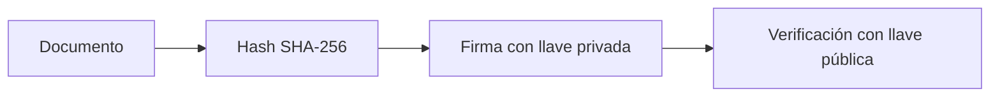
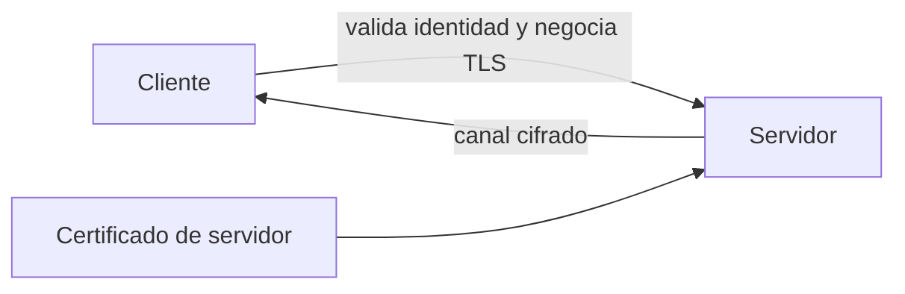
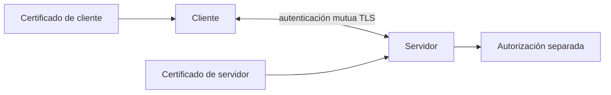

# Firmar un archivo y validar su integridad; después habilitar HTTPS en un servicio de prueba.

## Ruta guiada esencial — 20 minutos

### Escenario, objetivo y relación con la agenda

Debes demostrar que un archivo no fue alterado y habilitar HTTPS en un servicio local. Firmarás y verificarás un documento, comprobarás el fallo tras modificarlo y validarás un servidor HTTPS. Cubre 4.1 a 4.5 y la práctica aprobada del Capítulo 4.

### Prerrequisitos y archivos

- Capítulo 2 completado: `private/server.key` y `certs/server.crt`.
- OpenSSL, Python 3 y curl.
- Archivos nuevos: `signed/document.txt`, `signed/document.sig`, `signed/public-key.pem`, `scripts/https_server.py` y evidencia de validación.



#### Mapa visual: TLS



#### Mapa visual: mTLS



Ninguna llave privada viaja por la red. mTLS autentica certificados; la autorización sigue siendo una decisión independiente.

### Parte A — firma y verificación (10 minutos)

1. Prepara rutas y documento:

   ```bash
   export LAB_ROOT="${LAB_ROOT:-$HOME/cert-digital-lab}"
   export PRIVATE_KEY_PATH="$LAB_ROOT/private/server.key"
   export CERTIFICATE_PATH="$LAB_ROOT/certs/server.crt"
   mkdir -p "$LAB_ROOT"/{signed,scripts,evidence}
   printf 'Documento de prueba CERT_DIG\nVersión: 1\n' > "$LAB_ROOT/signed/document.txt"
   ```

2. Extrae la llave pública, firma y verifica:

   ```bash
   openssl x509 -in "$CERTIFICATE_PATH" -pubkey -noout > "$LAB_ROOT/signed/public-key.pem"
   openssl dgst -sha256 -sign "$PRIVATE_KEY_PATH" -out "$LAB_ROOT/signed/document.sig" "$LAB_ROOT/signed/document.txt"
   openssl dgst -sha256 -verify "$LAB_ROOT/signed/public-key.pem" -signature "$LAB_ROOT/signed/document.sig" "$LAB_ROOT/signed/document.txt"
   ```

3. Copia el documento, modifícalo y confirma `Verification failure`. No sobrescribas la evidencia original.

La firma demuestra integridad y posesión de la llave. El no repudio exige además identidad validada, custodia y contexto jurídico; no surge automáticamente de un certificado autofirmado.

### Parte B — HTTPS local (10 minutos)

1. Usa el servidor Python incluido en el procedimiento ampliado o el script preparado por el instructor, configurado con `<CERTIFICATE_PATH>`, `<PRIVATE_KEY_PATH>` y TLS 1.2 como mínimo.

2. Inicia el servicio en `<SERVICE_PORT>` y conserva su PID. Valida con confianza explícita:

   ```bash
   export SERVICE_PORT="8443"
   python3 "$LAB_ROOT/scripts/https_server.py" &
   HTTPS_PID=$!
   curl --cacert "$CERTIFICATE_PATH" --resolve service.local:${SERVICE_PORT}:127.0.0.1 "https://service.local:${SERVICE_PORT}/"
   openssl s_client -connect "127.0.0.1:${SERVICE_PORT}" -servername service.local -CAfile "$CERTIFICATE_PATH" </dev/null
   ```

3. Registra protocolo, suite criptográfica, Subject, SAN y `Verify return code`.

### Resultado esperado y validación final

- El documento original produce `Verified OK`; el manipulado, `Verification failure`.
- HTTPS responde y `s_client` muestra `Verify return code: 0 (ok)` usando confianza explícita.
- Evidencia observable: firma binaria, documento original y registro `evidence/chapter04-validation.txt`.

### Seguridad, troubleshooting y limpieza

- No copies ni muestres la llave privada; mTLS tampoco reemplaza autorización.
- No coloques `private/server.key` dentro de la imagen de un contenedor. En un despliegue real, usa un montaje protegido o integración con un gestor de secretos/KMS/HSM según la plataforma.
- Una variable de entorno sirve para referenciar una ruta, no para almacenar el contenido de una llave privada.
- No uses `--insecure` como solución. Para un error de confianza usa `--cacert` con el certificado esperado.
- Si certificado y llave no corresponden, compara sus claves públicas con SHA-256 y detén el servidor.
- Finaliza solo `$HTTPS_PID`. No instales el leaf en el trust store global y no uses `pkill -f`.

### Reflexión

1. ¿Por qué se firma el hash y se verifica con la llave pública?
2. ¿Qué valida TLS además del cifrado del canal?
3. ¿Qué certificado adicional necesita mTLS y qué no resuelve por sí mismo?

### Actividades opcionales — fuera de los 20 minutos

RSA-PSS, configuración nginx, demostración mTLS con certificado cliente y análisis detallado del handshake. Se mantienen como anexos y no forman parte del tiempo principal.

## Metadatos

| Campo        | Detalle                        |
|--------------|--------------------------------|
| Duración     | 50 minutos (ruta esencial)     |
| Complejidad  | Media                          |
| Nivel Bloom  | Aplicar (Apply)                |
| Práctica     | 4 de 5                         |
| Entorno      | Linux / WSL2                   |

---

## Descripción General

En esta práctica aplicarás directamente los conceptos de **firma digital** y **HTTPS** trabajados en el curso. En la **Parte A** usarás la llave privada y el certificado autofirmado generados en la Práctica 2 para firmar digitalmente un archivo de texto, verificarás la firma con la clave pública y simularás una manipulación del archivo para comprobar que la verificación falla. En la **Parte B** levantarás un servidor HTTPS local usando Python 3 con `ssl.SSLContext`, accederás a él con `curl` y desde el navegador, interpretarás los errores por certificado no confiable y aprenderás a añadir el certificado autofirmado como CA local de confianza. Al final revisarás conceptualmente la configuración de mTLS.

---

## Objetivos de Aprendizaje

Al completar esta práctica serás capaz de:

- [ ] Firmar digitalmente un archivo con `openssl dgst -sha256 -sign` y verificar su integridad con `openssl dgst -sha256 -verify`, comprendiendo la diferencia entre firma y cifrado.
- [ ] Demostrar que la modificación de un archivo firmado invalida la firma, reforzando el concepto de integridad.
- [ ] Configurar y levantar un servidor HTTPS local (Python 3 + `ssl.SSLContext`) usando el certificado autofirmado de la Práctica 2.
- [ ] Interpretar los mensajes de error TLS de `curl` y el navegador, y resolver la advertencia añadiendo el certificado como CA de confianza local.
- [ ] Describir los parámetros de configuración necesarios para habilitar mTLS (autenticación mutua) en nginx y su caso de uso en APIs REST.

---

## Prerequisitos

### Conocimiento previo

| Requisito | Detalle |
|-----------|---------|
| Práctica 2 completada | Debes contar con `private/server.key`, `certs/server.crt` y `csr/server.csr` bajo `<LAB_ROOT>` |
| Conceptos de firma digital | Diferencia entre firma y cifrado (lección 4.1) |
| Uso básico de terminal Linux | Navegación de directorios, edición de archivos, permisos |
| HTTP/HTTPS básico | Saber qué es un handshake TLS y para qué sirve un certificado |

### Acceso y herramientas requeridas

| Herramienta | Versión mínima | Verificación |
|-------------|----------------|--------------|
| OpenSSL | 3.x (mínimo 1.1.1) | `openssl version` |
| Python 3 | 3.8+ | `python3 --version` |
| curl | 7.x+ | `curl --version` |
| nginx (opcional, Parte B alternativa) | 1.18+ | `nginx -v` |

> **⚠️ Nota de seguridad:** Las llaves privadas (`.key`, `.pem`) generadas en todos los pasos deben tener permisos `600`. Nunca las compartas, subas a repositorios públicos ni las incluyas en capturas de pantalla.

---

## Entorno de Laboratorio

### Estructura de directorios esperada (herencia de Práctica 2)

```
cert-digital-lab/
├── private/server.key  ← llave privada RSA (chmod 600)
├── certs/server.crt    ← certificado autofirmado X.509
└── csr/server.csr      ← solicitud de firma (referencia)
```

### Verificación del entorno antes de comenzar

Ejecuta los siguientes comandos para confirmar que tienes todo lo necesario:

```bash
# 1. Verificar que el directorio de trabajo existe
export LAB_ROOT="${LAB_ROOT:-$HOME/cert-digital-lab}"
ls -la "$LAB_ROOT/private/server.key" "$LAB_ROOT/certs/server.crt" "$LAB_ROOT/csr/server.csr"

# 2. Verificar permisos de la llave privada (debe ser -rw-------)
stat -c "%a %n" "$LAB_ROOT/private/server.key"

# 3. Verificar que el certificado es válido y mostrar su resumen
openssl x509 -in "$LAB_ROOT/certs/server.crt" -noout -subject -issuer -dates

# 4. Verificar versiones de herramientas
openssl version && python3 --version && curl --version | head -1
```

**Salida esperada de verificación:**

```
# Ejemplo de salida de stat:
600 <LAB_ROOT>/private/server.key

# Ejemplo de salida de openssl x509:
subject=CN=localhost, O=LabTest, C=MX
issuer=CN=localhost, O=LabTest, C=MX
notBefore=Jan  1 00:00:00 2024 GMT
notAfter=Jan  1 00:00:00 2025 GMT
```

### Preparación del directorio de trabajo para esta práctica

```bash
# Crear subdirectorio para los artefactos de la Práctica 4
mkdir -p "$LAB_ROOT"/{signed,scripts,evidence}
cd "$LAB_ROOT/signed"

# Referenciar los artefactos canónicos sin duplicar la llave privada
SERVER_KEY="$LAB_ROOT/private/server.key"
SERVER_CERT="$LAB_ROOT/certs/server.crt"

# Extraer la llave pública del certificado (necesaria para verificar firmas)
openssl x509 -in "$SERVER_CERT" -pubkey -noout > pubkey.pem

# Verificar que la llave pública se extrajo correctamente
head -3 pubkey.pem
```

**Salida esperada:**

```
-----BEGIN PUBLIC KEY-----
MIIBIjANBgkqhkiG9w0BAQEFAAOCAQ8AMIIBCgKCAQEA...
```

---

## Anexo opcional: procedimiento ampliado

> **Referencia no ejecutable sin revisión del instructor:** no uses `--insecure`, no instales el leaf en el trust store global y sustituye comparaciones MD5 por SHA-256 de claves públicas. Las operaciones con `sudo` quedan excluidas de la práctica del alumno.

---

### PARTE A: Firma Digital de Archivos

---

### Paso A-1: Crear el archivo a firmar (documento de prueba)

**Objetivo:** Preparar un archivo de texto que simule un documento sensible (contrato, configuración o hash de release) que necesita ser firmado digitalmente para garantizar integridad y autenticidad.

**Instrucciones:**

1. Navega al directorio de trabajo de la práctica:

```bash
cd "$LAB_ROOT/signed"
```

2. Crea el archivo de documento simulado:

```bash
cat > contrato_servicio.txt << 'EOF'
CONTRATO DE NIVEL DE SERVICIO (SLA) - SIMULADO
===============================================
Fecha: 2024-01-15
Proveedor: TechCorp S.A. de C.V.
Cliente: Empresa Demo S.A.
Servicio: Plataforma de Pagos API v2

Términos:
- Disponibilidad garantizada: 99.9% mensual
- Tiempo máximo de respuesta API: 200ms (p95)
- Ventana de mantenimiento: domingos 02:00-04:00 UTC
- Soporte: 24/7 para incidentes críticos (Sev1)

Versión del documento: 1.0.0
Hash de configuración: a3f8c2d1e9b4...
EOF
```

3. Verifica el contenido del archivo:

```bash
cat contrato_servicio.txt
wc -c contrato_servicio.txt
```

**Salida esperada:**

```
CONTRATO DE NIVEL DE SERVICIO (SLA) - SIMULADO
===============================================
...
[número de bytes] contrato_servicio.txt
```

**Verificación:**

```bash
# El archivo debe existir y tener contenido
test -s contrato_servicio.txt && echo "✓ Archivo creado correctamente" || echo "✗ Error: archivo vacío o inexistente"
```

---

### Paso A-2: Firmar el archivo con la llave privada (RSA + SHA-256)

**Objetivo:** Aplicar el proceso de firma digital usando `openssl dgst -sha256 -sign`. Este comando: (1) calcula el hash SHA-256 del archivo, (2) cifra ese hash con la llave privada RSA del firmante, produciendo la firma digital.

**Instrucciones:**

1. Firma el archivo `contrato_servicio.txt` usando la llave privada:

```bash
openssl dgst -sha256 \
  -sign "$SERVER_KEY" \
  -out contrato_servicio.sig \
  contrato_servicio.txt
```

2. Verifica que el archivo de firma fue creado:

```bash
ls -la contrato_servicio.sig
```

3. Inspecciona el contenido binario de la firma (primeros bytes en hexadecimal):

```bash
xxd contrato_servicio.sig | head -5
```

4. Muestra el tamaño de la firma (para RSA-2048 debería ser 256 bytes):

```bash
wc -c contrato_servicio.sig
```

> **💡 Nota conceptual:** La firma (`contrato_servicio.sig`) es el hash SHA-256 del archivo cifrado con la llave privada. Cualquier persona con la llave pública correspondiente puede descifrar ese hash y compararlo con el hash del archivo recibido. Si coinciden, la firma es válida. El archivo original NO está cifrado: sigue siendo legible. Esto ilustra la diferencia fundamental entre firma y cifrado: la firma garantiza integridad y autenticidad, pero no confidencialidad.

**Salida esperada:**

```
# ls -la contrato_servicio.sig
-rw-r--r-- 1 usuario usuario 256 Jan 15 10:30 contrato_servicio.sig

# wc -c contrato_servicio.sig
256 contrato_servicio.sig

# xxd (primeros bytes - binario no legible como texto)
00000000: 3082 0100 ...
```

**Verificación:**

```bash
# La firma debe tener exactamente 256 bytes para RSA-2048
SIGSIZE=$(wc -c < contrato_servicio.sig)
[ "$SIGSIZE" -eq 256 ] && echo "✓ Firma RSA-2048 generada (256 bytes)" || echo "⚠ Tamaño inesperado: $SIGSIZE bytes (puede ser RSA-4096 u otro tamaño)"
```

---

### Paso A-3: Verificar la firma con la llave pública

**Objetivo:** Simular el rol del receptor/verificador que, sin tener la llave privada, puede confirmar que el archivo no fue alterado y que fue firmado por el poseedor de la llave privada correspondiente.

**Instrucciones:**

1. Verifica que la llave pública esté disponible (fue extraída en la preparación):

```bash
ls -la pubkey.pem
head -1 pubkey.pem
```

2. Verifica la firma del archivo:

```bash
openssl dgst -sha256 \
  -verify pubkey.pem \
  -signature contrato_servicio.sig \
  contrato_servicio.txt
```

3. Observa el resultado y anótalo.

**Salida esperada:**

```
Verified OK
```

**Verificación:**

```bash
# Capturar el resultado de la verificación en una variable
RESULT=$(openssl dgst -sha256 -verify pubkey.pem -signature contrato_servicio.sig contrato_servicio.txt 2>&1)
echo "Resultado: $RESULT"
[ "$RESULT" = "Verified OK" ] && echo "✓ Firma válida: integridad y autenticidad confirmadas" || echo "✗ Firma inválida"
```

---

### Paso A-4: Simular manipulación del archivo (demostración de integridad)

**Objetivo:** Demostrar que cualquier modificación al archivo firmado invalida la firma, reforzando el concepto de **integridad** que provee la firma digital. Este es un escenario realista: un atacante o error en transmisión que altera el contenido.

**Instrucciones:**

1. Crea una copia del archivo original (para restaurarlo después):

```bash
cp contrato_servicio.txt contrato_servicio_original.txt
```

2. Simula una manipulación maliciosa (cambiar el porcentaje de disponibilidad del SLA):

```bash
# Modificación: cambiar 99.9% por 99.0% (manipulación sutil)
sed -i 's/99.9% mensual/99.0% mensual/' contrato_servicio.txt

# Verificar que el cambio se realizó
grep "Disponibilidad" contrato_servicio.txt
```

3. Intenta verificar la firma sobre el archivo manipulado:

```bash
openssl dgst -sha256 \
  -verify pubkey.pem \
  -signature contrato_servicio.sig \
  contrato_servicio.txt
```

4. Observa el resultado. **Debería fallar.**

5. Restaura el archivo original:

```bash
cp contrato_servicio_original.txt contrato_servicio.txt
grep "Disponibilidad" contrato_servicio.txt
```

6. Verifica nuevamente con el archivo restaurado para confirmar que la firma vuelve a ser válida:

```bash
openssl dgst -sha256 \
  -verify pubkey.pem \
  -signature contrato_servicio.sig \
  contrato_servicio.txt
```

> **💡 Reflexión:** Incluso un cambio de un solo carácter (`9` → `0`) produce un hash SHA-256 completamente diferente (efecto avalancha). La firma, calculada sobre el hash original, no puede coincidir con el hash del archivo modificado. Esto es precisamente lo que garantiza la **integridad**: no es posible alterar el contenido sin que la verificación lo detecte.

**Salida esperada:**

```
# Paso 3 - Verificación sobre archivo manipulado:
Verification failure
4077F3E2617F0000:error:02000077:rsa routines:RSA_padding_check_PKCS1_type_1:invalid padding:...

# Paso 6 - Verificación sobre archivo restaurado:
Verified OK
```

**Verificación:**

```bash
# Verificación final: el archivo restaurado debe pasar
FINAL=$(openssl dgst -sha256 -verify pubkey.pem -signature contrato_servicio.sig contrato_servicio.txt 2>&1)
[ "$FINAL" = "Verified OK" ] && echo "✓ Archivo restaurado: firma válida nuevamente" || echo "✗ Error: el archivo no fue restaurado correctamente"
```

---

### Paso A-5: (Opcional) Firma con RSA-PSS (algoritmo de padding moderno)

**Objetivo:** Aplicar el padding RSA-PSS, recomendado por NIST y RFC 8017 como alternativa más segura a PKCS#1 v1.5 para firmas RSA.

**Instrucciones:**

1. Firma con RSA-PSS:

```bash
openssl dgst -sha256 \
  -sign "$SERVER_KEY" \
  -sigopt rsa_padding_mode:pss \
  -sigopt rsa_pss_saltlen:-1 \
  -out contrato_pss.sig \
  contrato_servicio.txt
```

2. Verifica la firma RSA-PSS:

```bash
openssl dgst -sha256 \
  -verify pubkey.pem \
  -sigopt rsa_padding_mode:pss \
  -sigopt rsa_pss_saltlen:-1 \
  -signature contrato_pss.sig \
  contrato_servicio.txt
```

**Salida esperada:**

```
Verified OK
```

> **💡 Nota:** RSA-PSS incluye un componente aleatorio (salt), lo que significa que dos firmas del mismo archivo con la misma llave serán diferentes entre sí, pero ambas verificables. Esto es una propiedad de seguridad deseable (evita ataques de firma determinista).

---

### PARTE B: Servidor HTTPS Local con Certificado Autofirmado

---

### Paso B-1: Crear el servidor HTTPS con Python 3 y ssl.SSLContext

**Objetivo:** Configurar y levantar un servidor HTTPS mínimo usando Python 3 con `ssl.SSLContext`, utilizando el certificado y la llave privada de la Práctica 2. Esto simula un microservicio o API interna que requiere TLS.

**Instrucciones:**

1. Crea el directorio raíz del servidor y un archivo HTML de prueba:

```bash
mkdir -p "$LAB_ROOT/scripts/www"
cat > "$LAB_ROOT/scripts/www/index.html" << 'EOF'
<!DOCTYPE html>
<html>
<head><title>Lab HTTPS - Práctica 4</title></head>
<body>
  <h1>✓ Servidor HTTPS funcionando</h1>
  <p>Certificado autofirmado activo. Conexión TLS establecida correctamente.</p>
  <p>Práctica 4 - Laboratorio de Certificados Digitales</p>
</body>
</html>
EOF
```

2. Crea el script del servidor HTTPS en Python:

```bash
cat > "$LAB_ROOT/scripts/https_server.py" << 'EOF'
#!/usr/bin/env python3
"""
Servidor HTTPS mínimo para laboratorio de certificados.
Usa ssl.SSLContext con TLS 1.2/1.3 y el certificado autofirmado de la Práctica 2.
"""
import ssl
import os
from http.server import HTTPServer, SimpleHTTPRequestHandler

# Configuración
HOST = "localhost"
PORT = 8443
LAB_ROOT = os.path.expanduser("~/cert-digital-lab")
CERT_FILE = os.path.join(LAB_ROOT, "certs", "server.crt")
KEY_FILE  = os.path.join(LAB_ROOT, "private", "server.key")
WWW_DIR   = os.path.join(LAB_ROOT, "scripts", "www")

def main():
    # Cambiar al directorio raíz del servidor
    os.chdir(WWW_DIR)

    # Crear contexto SSL con configuración segura
    context = ssl.SSLContext(ssl.PROTOCOL_TLS_SERVER)

    # Cargar certificado y llave privada
    context.load_cert_chain(certfile=CERT_FILE, keyfile=KEY_FILE)

    # Configurar versiones TLS permitidas (mínimo TLS 1.2)
    context.minimum_version = ssl.TLSVersion.TLSv1_2

    # Crear el servidor HTTP y envolver con SSL
    httpd = HTTPServer((HOST, PORT), SimpleHTTPRequestHandler)
    httpd.socket = context.wrap_socket(httpd.socket, server_side=True)

    print(f"[*] Servidor HTTPS iniciado en https://{HOST}:{PORT}/")
    print(f"[*] Certificado: {CERT_FILE}")
    print(f"[*] Directorio raíz: {WWW_DIR}")
    print("[*] Presiona Ctrl+C para detener")
    print("-" * 50)

    try:
        httpd.serve_forever()
    except KeyboardInterrupt:
        print("\n[*] Servidor detenido.")
        httpd.server_close()

if __name__ == "__main__":
    main()
EOF
```

3. Verifica que los archivos de certificado son accesibles desde el script:

```bash
ls -la "$SERVER_CERT" "$SERVER_KEY"
```

4. Inicia el servidor HTTPS en segundo plano:

```bash
cd "$LAB_ROOT/scripts"
python3 https_server.py &
HTTPS_PID=$!
echo "Servidor HTTPS iniciado con PID: $HTTPS_PID"

# Guardar el PID para poder detenerlo después
echo $HTTPS_PID > /tmp/https_server.pid

# Esperar 1 segundo para que el servidor arranque
sleep 1
```

**Salida esperada:**

```
[*] Servidor HTTPS iniciado en https://localhost:8443/
[*] Certificado: /home/usuario/labs/certs/practica4/server.crt
[*] Directorio raíz: /home/usuario/labs/certs/practica4/www
[*] Presiona Ctrl+C para detener
--------------------------------------------------
Servidor HTTPS iniciado con PID: 12345
```

**Verificación:**

```bash
# Verificar que el proceso está corriendo
ps aux | grep https_server.py | grep -v grep && echo "✓ Servidor HTTPS activo" || echo "✗ El servidor no está corriendo"

# Verificar que el puerto 8443 está en escucha
ss -tlnp | grep 8443 && echo "✓ Puerto 8443 en escucha" || echo "✗ Puerto 8443 no disponible"
```

---

### Paso B-2: Acceder al servidor con curl (con y sin --insecure)

**Objetivo:** Observar el comportamiento de `curl` ante un certificado autofirmado no confiable, comprender el error TLS y saber cuándo y por qué usar `--insecure` (y sus implicaciones de seguridad).

**Instrucciones:**

1. **Intento 1: curl sin opciones especiales (comportamiento por defecto — debería fallar):**

```bash
curl https://localhost:8443/
```

2. Observa el error. Anota el código de error de curl.

3. **Intento 2: curl con `--insecure` (deshabilita validación de certificado):**

```bash
curl --insecure https://localhost:8443/
```

4. Observa que ahora obtienes el contenido HTML.

5. **Intento 3: curl con `--cacert` (especifica el certificado autofirmado como CA de confianza):**

```bash
curl --cacert "$SERVER_CERT" https://localhost:8443/
```

6. **Intento 4: curl con `-v` (verbose) para ver el handshake TLS completo:**

```bash
curl -v --cacert "$SERVER_CERT" https://localhost:8443/ 2>&1 | head -40
```

7. Identifica en la salida verbose:
   - La versión de TLS negociada (`TLSv1.3` o `TLSv1.2`)
   - El cipher suite seleccionado
   - El subject del certificado del servidor
   - La línea `SSL connection using`

> **⚠️ Advertencia de seguridad:** `--insecure` deshabilita completamente la validación del certificado, lo que expone la conexión a ataques Man-in-the-Middle. **Nunca uses `--insecure` en entornos de producción.** La opción correcta es `--cacert` para especificar una CA de confianza, o añadir el certificado al store del sistema.

**Salida esperada:**

```bash
# Intento 1 - Sin opciones (falla esperada):
curl: (60) SSL certificate problem: self-signed certificate
More details here: https://curl.se/docs/sslcerts.html
...

# Intento 2 - Con --insecure (funciona pero inseguro):
<!DOCTYPE html>
<html>
...✓ Servidor HTTPS funcionando...

# Intento 3 - Con --cacert (correcto y seguro):
<!DOCTYPE html>
<html>
...✓ Servidor HTTPS funcionando...

# Intento 4 - Verbose (extracto):
* Trying 127.0.0.1:8443...
* Connected to localhost (127.0.0.1) port 8443
* SSL connection using TLSv1.3 / TLS_AES_256_GCM_SHA384
* Server certificate:
*  subject: CN=localhost; O=LabTest; C=MX
*  SSL certificate verify ok.
```

**Verificación:**

```bash
# La conexión con --cacert debe retornar HTTP 200
HTTP_CODE=$(curl -s -o /dev/null -w "%{http_code}" --cacert "$SERVER_CERT" https://localhost:8443/)
[ "$HTTP_CODE" = "200" ] && echo "✓ Servidor HTTPS responde HTTP 200 con certificado de confianza" || echo "✗ Error HTTP: $HTTP_CODE"
```

---

### Paso B-3: Inspeccionar el certificado del servidor con openssl s_client

**Objetivo:** Usar `openssl s_client` para conectarse al servidor HTTPS y analizar el handshake TLS, los detalles del certificado y la cadena de confianza, tal como lo haría un administrador diagnosticando un problema de TLS.

**Instrucciones:**

1. Conecta con `openssl s_client` y captura la información del handshake:

```bash
echo "GET / HTTP/1.0" | openssl s_client \
  -connect localhost:8443 \
  -CAfile "$SERVER_CERT" \
  2>&1 | head -60
```

2. Para ver solo la información del certificado (sin el contenido HTTP):

```bash
echo "" | openssl s_client \
  -connect localhost:8443 \
  -CAfile "$SERVER_CERT" \
  -showcerts \
  2>&1 | grep -E "(subject|issuer|Verify|Protocol|Cipher|notBefore|notAfter)"
```

3. Verifica la versión de TLS y el cipher suite negociado:

```bash
echo "" | openssl s_client \
  -connect localhost:8443 \
  -CAfile "$SERVER_CERT" \
  2>&1 | grep -E "(Protocol|Cipher Suite|TLS)"
```

**Salida esperada:**

```
subject=CN=localhost, O=LabTest, C=MX
issuer=CN=localhost, O=LabTest, C=MX
Protocol  : TLSv1.3
Cipher    : TLS_AES_256_GCM_SHA384
Verify return code: 0 (ok)
```

> **💡 Interpretación:** `Verify return code: 0 (ok)` confirma una confianza explícita y limitada a este comando mediante `-CAfile "$SERVER_CERT"`. El certificado sigue siendo una entidad final autofirmada; no debe presentarse como una CA raíz de producción.

**Verificación:**

```bash
# Verificar que el return code sea 0 (OK) al usar --CAfile
VERIFY_CODE=$(echo "" | openssl s_client -connect localhost:8443 -CAfile "$SERVER_CERT" 2>&1 | grep "Verify return code" | awk '{print $4}')
[ "$VERIFY_CODE" = "0" ] && echo "✓ Verificación TLS exitosa (return code: 0)" || echo "⚠ Código de verificación: $VERIFY_CODE"
```

---

### Paso B-4: Añadir el certificado autofirmado al store del sistema (Linux)

**Objetivo:** Aprender a registrar un certificado autofirmado como CA de confianza en el sistema operativo Linux, de modo que las herramientas que usan el store del sistema (curl sin `--cacert`, navegadores, etc.) confíen en él automáticamente.

**Instrucciones:**

1. Copia el certificado al directorio de CAs del sistema:

```bash
# En Ubuntu/Debian:
sudo cp server.crt /usr/local/share/ca-certificates/lab-practica4.crt

# En RHEL/CentOS/Fedora (usa extensión .pem):
# sudo cp server.crt /etc/pki/ca-trust/source/anchors/lab-practica4.pem
```

2. Actualiza el store de certificados del sistema:

```bash
# Ubuntu/Debian:
sudo update-ca-certificates

# RHEL/CentOS/Fedora:
# sudo update-ca-trust extract
```

3. Verifica que el certificado fue añadido:

```bash
# Ubuntu/Debian:
ls /etc/ssl/certs/ | grep lab-practica4
```

4. Prueba curl **sin** `--cacert` (ahora debería funcionar gracias al store del sistema):

```bash
curl https://localhost:8443/
```

5. Verifica que funciona sin advertencias:

```bash
curl -v https://localhost:8443/ 2>&1 | grep -E "(SSL certificate verify|subject|HTTP)"
```

**Salida esperada:**

```
# update-ca-certificates:
Updating certificates in /etc/ssl/certs...
1 added, 0 removed; done.

# curl sin --cacert:
<!DOCTYPE html>
<html>...✓ Servidor HTTPS funcionando...

# curl -v:
* SSL certificate verify ok.
```

**Verificación:**

```bash
# curl sin --cacert debe funcionar ahora
HTTP_CODE_SYSTEM=$(curl -s -o /dev/null -w "%{http_code}" https://localhost:8443/ 2>/dev/null)
[ "$HTTP_CODE_SYSTEM" = "200" ] && echo "✓ Certificado en store del sistema: curl funciona sin --cacert" || echo "⚠ El store del sistema aún no confía en el certificado (código: $HTTP_CODE_SYSTEM)"
```

> **💡 Nota:** En el navegador (Firefox/Chrome), el store del sistema puede no ser suficiente en todos los casos. Firefox usa su propio store NSS. Para añadirlo en Firefox, ve a `Preferencias → Privacidad y Seguridad → Certificados → Ver certificados → Autoridades → Importar`.

---

### Paso B-5: Concepto de mTLS — Autenticación Mutua TLS

**Objetivo:** Comprender qué es mTLS (Mutual TLS), en qué se diferencia del TLS estándar y qué parámetros de configuración adicionales se necesitarían en nginx para habilitarlo.

**Instrucciones:**

1. Lee la explicación conceptual y ejecuta los comandos de análisis:

```bash
# Mostrar los Key Usage del certificado actual
# (En mTLS, el certificado de cliente necesita clientAuth en EKU)
openssl x509 -in server.crt -noout -text | grep -A 5 "Key Usage"
```

2. Observa si el certificado tiene `Extended Key Usage` con `TLS Web Client Authentication`.

3. Revisa la configuración de nginx que habilitaría mTLS (solo lectura conceptual):

```bash
# Crear un archivo de referencia con la configuración nginx para mTLS
cat > "$LAB_ROOT/config/nginx_mtls_reference.conf" << 'EOF'
# ============================================================
# REFERENCIA: Configuración nginx para mTLS (Mutual TLS)
# NO ejecutar directamente - solo para estudio conceptual
# ============================================================

server {
    listen 8443 ssl;
    server_name localhost;

    # --- Certificado del SERVIDOR (igual que TLS estándar) ---
    ssl_certificate     <CERTIFICATE_PATH>;
    ssl_certificate_key <PRIVATE_KEY_PATH>;

    # --- Versiones TLS permitidas ---
    ssl_protocols TLSv1.2 TLSv1.3;
    ssl_ciphers   HIGH:!aNULL:!MD5;

    # ============================================================
    # PARÁMETROS ADICIONALES PARA mTLS (Autenticación del CLIENTE)
    # ============================================================

    # CA que firmó los certificados de los clientes autorizados
    ssl_client_certificate /home/usuario/labs/certs/practica4/client-ca.crt;

    # Requerir certificado de cliente (on = obligatorio, optional = opcional)
    ssl_verify_client on;

    # Profundidad máxima de la cadena de confianza del cliente
    ssl_verify_depth 2;

    location / {
        # Variables disponibles cuando mTLS está activo:
        # $ssl_client_verify     -> "SUCCESS", "FAILED", "NONE"
        # $ssl_client_s_dn       -> Subject DN del certificado del cliente
        # $ssl_client_fingerprint -> Fingerprint SHA-1 del certificado del cliente

        # Ejemplo: denegar acceso si el cliente no presentó certificado válido
        if ($ssl_client_verify != SUCCESS) {
            return 403 "Certificado de cliente requerido";
        }

        # Pasar información del cliente al backend como headers
        proxy_set_header X-SSL-Client-Cert    $ssl_client_cert;
        proxy_set_header X-SSL-Client-DN      $ssl_client_s_dn;
        proxy_set_header X-SSL-Client-Verify  $ssl_client_verify;

        root /var/www/html;
        index index.html;
    }
}
EOF

cat "$LAB_ROOT/config/nginx_mtls_reference.conf"
```

4. Analiza la diferencia entre TLS estándar y mTLS:

```bash
cat << 'EOF'
=======================================================
COMPARACIÓN: TLS Estándar vs mTLS
=======================================================

TLS Estándar (unidireccional):
  Cliente → verifica certificado del SERVIDOR
  Servidor → NO verifica certificado del cliente
  Uso: Sitios web públicos, APIs abiertas

mTLS (bidireccional):
  Cliente → verifica certificado del SERVIDOR
  Servidor → verifica certificado del CLIENTE
  Uso: APIs internas, microservicios, Zero Trust,
       comunicación entre servicios (service mesh),
       VPNs corporativas, IoT

Parámetros clave en nginx para mTLS:
  ssl_client_certificate → CA que firmó certs de clientes
  ssl_verify_client on   → Hace la verificación obligatoria
  ssl_verify_depth N     → Profundidad de cadena de confianza

Flujo mTLS simplificado:
  1. Cliente → "ClientHello"
  2. Servidor → "ServerHello" + Certificado del servidor
               + "CertificateRequest" (pide cert al cliente)
  3. Cliente → Certificado del cliente + Firma
  4. Servidor → Verifica cert del cliente contra ssl_client_certificate
  5. Ambos → Establecen sesión cifrada
=======================================================
EOF
```

**Verificación conceptual:**

```bash
# Verificar que el archivo de referencia fue creado
test -f "$LAB_ROOT/config/nginx_mtls_reference.conf" && \
  echo "✓ Archivo de referencia mTLS creado en: $LAB_ROOT/config/nginx_mtls_reference.conf" || \
  echo "✗ Error al crear el archivo de referencia"
```

---

## Validación y Pruebas Finales

Ejecuta esta batería de validaciones para confirmar que completaste todos los objetivos de la práctica:

```bash
#!/bin/bash
# Script de validación completa - Lab 04-00-01
echo "========================================"
echo "VALIDACIÓN COMPLETA - LAB 04-00-01"
echo "========================================"
cd "$LAB_ROOT/signed"

PASS=0
FAIL=0

check() {
    local desc="$1"
    local result="$2"
    if [ "$result" = "true" ]; then
        echo "✓ PASS: $desc"
        ((PASS++))
    else
        echo "✗ FAIL: $desc"
        ((FAIL++))
    fi
}

# --- PARTE A ---
echo ""
echo "--- PARTE A: Firma Digital ---"

# A1: Archivo de documento existe
check "Archivo contrato_servicio.txt existe" \
  "$(test -s contrato_servicio.txt && echo true || echo false)"

# A2: Firma generada
check "Archivo de firma contrato_servicio.sig existe" \
  "$(test -s contrato_servicio.sig && echo true || echo false)"

# A3: Verificación de firma exitosa
VERIFY=$(openssl dgst -sha256 -verify pubkey.pem -signature contrato_servicio.sig contrato_servicio.txt 2>&1)
check "Verificación de firma: Verified OK" \
  "$( [ "$VERIFY" = "Verified OK" ] && echo true || echo false)"

# A4: Firma PSS (opcional)
check "Firma RSA-PSS generada (contrato_pss.sig)" \
  "$(test -s contrato_pss.sig && echo true || echo false)"

# --- PARTE B ---
echo ""
echo "--- PARTE B: Servidor HTTPS ---"

# B1: Servidor corriendo
check "Servidor HTTPS Python activo (puerto 8443)" \
  "$(ss -tlnp 2>/dev/null | grep -q 8443 && echo true || echo false)"

# B2: Respuesta HTTP 200 con --cacert
HTTP_CODE=$(curl -s -o /dev/null -w "%{http_code}" --cacert "$SERVER_CERT" https://localhost:8443/ 2>/dev/null)
check "curl con --cacert retorna HTTP 200" \
  "$( [ "$HTTP_CODE" = "200" ] && echo true || echo false)"

# B3: Verificación TLS s_client OK
VERIFY_CODE=$(echo "" | openssl s_client -connect localhost:8443 -CAfile "$SERVER_CERT" 2>&1 | grep "Verify return code" | awk '{print $4}')
check "openssl s_client: Verify return code 0 (ok)" \
  "$( [ "$VERIFY_CODE" = "0" ] && echo true || echo false)"

# B4: Archivo de referencia mTLS
check "Archivo de referencia mTLS creado" \
  "$(test -f nginx_mtls_reference.conf && echo true || echo false)"

echo ""
echo "========================================"
echo "Resultado: $PASS pasaron, $FAIL fallaron"
echo "========================================"
```

---

## Solución de Problemas

### Problema 1: El servidor HTTPS Python falla al iniciar con `ssl.SSLError: [SSL] PEM lib`

**Síntoma:**

```
ssl.SSLError: [SSL: PEM_LIB] PEM lib (_ssl.c:4065)
# o
FileNotFoundError: [Errno 2] No such file or directory: '/home/usuario/labs/certs/practica4/server.key'
```

**Causa:** Los enlaces simbólicos (`ln -s`) creados en la preparación apuntan a rutas relativas que no se resuelven correctamente cuando Python lee las rutas expandidas con `os.path.expanduser()`, o los archivos de certificado/llave no existen en la ruta especificada en el script.

**Solución:**

```bash
# 1. Verificar que los archivos existen y son accesibles
ls -la "$SERVER_KEY" "$SERVER_CERT"

# 2. Si los enlaces simbólicos están rotos, copiar los archivos directamente
cd "$LAB_ROOT/signed"
chmod 600 "$SERVER_KEY"

# 3. Verificar que la llave y el certificado corresponden (el módulo público debe coincidir)
openssl x509 -noout -modulus -in server.crt | md5sum
openssl rsa -noout -modulus -in server.key | md5sum
# Ambos md5sum deben ser idénticos

# 4. Reiniciar el servidor
kill $(cat /tmp/https_server.pid) 2>/dev/null
python3 https_server.py &
echo $! > /tmp/https_server.pid
```

---

### Problema 2: `openssl dgst -verify` retorna `Verification failure` en el archivo original sin haber sido modificado

**Síntoma:**

```
Verification failure
4077F3E2617F0000:error:02000077:rsa routines:...
```

El archivo no fue modificado manualmente, pero la verificación falla.

**Causa:** La llave pública extraída (`pubkey.pem`) no corresponde al par de llaves que generó la firma. Esto ocurre si: (a) se regeneró la llave privada (`server.key`) después de firmar, (b) se extrajo la llave pública de un certificado diferente, o (c) se usó una llave diferente para firmar y para verificar.

**Solución:**

```bash
# 1. Verificar que pubkey.pem fue extraída del certificado correcto
openssl x509 -in server.crt -pubkey -noout | md5sum
md5sum pubkey.pem
# Si los md5sum difieren, la pubkey.pem está desactualizada

# 2. Re-extraer la llave pública del certificado actual
openssl x509 -in server.crt -pubkey -noout > pubkey.pem
echo "Llave pública re-extraída"

# 3. Verificar que la llave privada y el certificado son un par válido
CERT_MOD=$(openssl x509 -noout -modulus -in server.crt | md5sum)
KEY_MOD=$(openssl rsa -noout -modulus -in server.key | md5sum)
[ "$CERT_MOD" = "$KEY_MOD" ] && echo "✓ Par llave/certificado válido" || echo "✗ MISMATCH: llave y certificado no corresponden"

# 4. Si hay mismatch, volver a firmar con la llave correcta
openssl dgst -sha256 -sign server.key -out contrato_servicio.sig contrato_servicio.txt
openssl dgst -sha256 -verify pubkey.pem -signature contrato_servicio.sig contrato_servicio.txt
```

---

## Limpieza del Entorno

```bash
# 1. Detener el servidor HTTPS Python
echo "[*] Deteniendo servidor HTTPS..."
kill $(cat /tmp/https_server.pid) 2>/dev/null && echo "✓ Servidor detenido" || echo "⚠ El servidor ya no estaba activo"
rm -f /tmp/https_server.pid

# 2. Verificar que el puerto 8443 fue liberado
sleep 1
ss -tlnp | grep 8443 && echo "⚠ Puerto 8443 aún en uso" || echo "✓ Puerto 8443 liberado"

# 3. Remover el certificado del store del sistema (si fue añadido)
echo "[*] Removiendo certificado del store del sistema..."
sudo rm -f /usr/local/share/ca-certificates/lab-practica4.crt
sudo update-ca-certificates --fresh 2>/dev/null | tail -2
# Para RHEL/CentOS: sudo rm -f /etc/pki/ca-trust/source/anchors/lab-practica4.pem && sudo update-ca-trust extract

# 4. Listar artefactos generados (NO eliminar - se usan en Práctica 5)
echo ""
echo "[*] Artefactos generados en esta práctica (conservar para Práctica 5):"
ls -la "$LAB_ROOT/signed/"

# 5. Verificar permisos de seguridad en llaves privadas
echo ""
echo "[*] Verificando permisos de llaves privadas:"
find "$LAB_ROOT/private" -name "*.key" -exec stat -c "%a %n" {} \; | while read perm file; do
    [ "$perm" = "600" ] && echo "✓ $perm $file" || echo "⚠ INSEGURO: $perm $file — ejecuta: chmod 600 $file"
done
```

> **⚠️ Importante:** Los archivos `server.key`, `server.crt`, `contrato_servicio.txt` y `contrato_servicio.sig` son necesarios para la **Práctica 5**. No los elimines hasta completar el curso.

---

## Resumen

En esta práctica aplicaste dos capacidades fundamentales de los certificados digitales X.509:

| Parte | Acción | Concepto reforzado |
|-------|--------|-------------------|
| A-1 a A-4 | Firmaste un archivo con `openssl dgst -sign` y verificaste con `-verify` | Integridad, autenticidad, no repudio |
| A-4 | Modificaste el archivo y comprobaste que la firma falla | Efecto avalancha del hash, integridad garantizada |
| A-5 | Firmaste con RSA-PSS (padding moderno) | Mejores prácticas criptográficas (RFC 8017) |
| B-1 | Levantaste un servidor HTTPS con Python + `ssl.SSLContext` | TLS en servicios reales, configuración mínima |
| B-2 | Usaste `curl` con `--insecure`, `--cacert` y `-v` | Validación de certificados, riesgos de `--insecure` |
| B-3 | Inspeccionaste el handshake TLS con `openssl s_client` | Diagnóstico de TLS, interpretación de salidas |
| B-4 | Añadiste el certificado al store del sistema | Gestión de CAs de confianza en Linux |
| B-5 | Revisaste la configuración mTLS en nginx | Autenticación mutua, Zero Trust, APIs seguras |

### Diferencias clave que debes recordar

```
Firma digital:
  Llave PRIVADA → crea la firma
  Llave PÚBLICA → verifica la firma
  Garantiza: integridad + autenticidad (+ no repudio con controles adicionales)
  Contenido: permanece visible (no cifrado)

Cifrado asimétrico:
  Llave PÚBLICA → cifra
  Llave PRIVADA → descifra
  Garantiza: confidencialidad
  Contenido: queda oculto

TLS estándar: el cliente verifica el servidor (1 dirección)
mTLS:         el servidor también verifica al cliente (2 direcciones)
```

### Recursos Adicionales

- [RFC 8017 — RSA Cryptography Specifications (RSA-PSS, RSA-OAEP)](https://www.rfc-editor.org/rfc/rfc8017)
- [OpenSSL dgst(1) — Documentación oficial](https://www.openssl.org/docs/man3.0/man1/openssl-dgst.html)
- [Python ssl module — SSLContext documentation](https://docs.python.org/3/library/ssl.html)
- [nginx SSL/TLS configuration — ssl_verify_client](https://nginx.org/en/docs/http/ngx_http_ssl_module.html#ssl_verify_client)
- [RFC 8446 — TLS 1.3](https://www.rfc-editor.org/rfc/rfc8446)
- [NIST SP 800-57 Part 1 — Key Management Recommendations](https://csrc.nist.gov/publications/detail/sp/800-57-part-1/rev-5/final)

---
